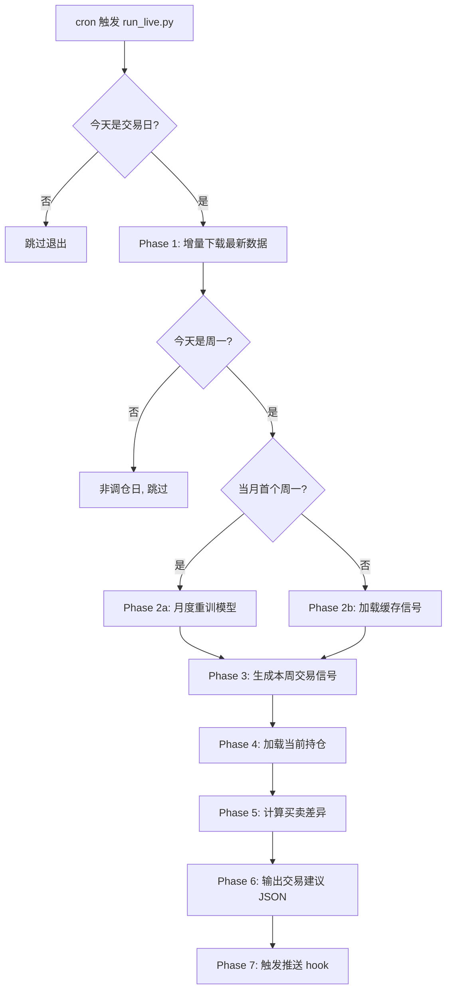
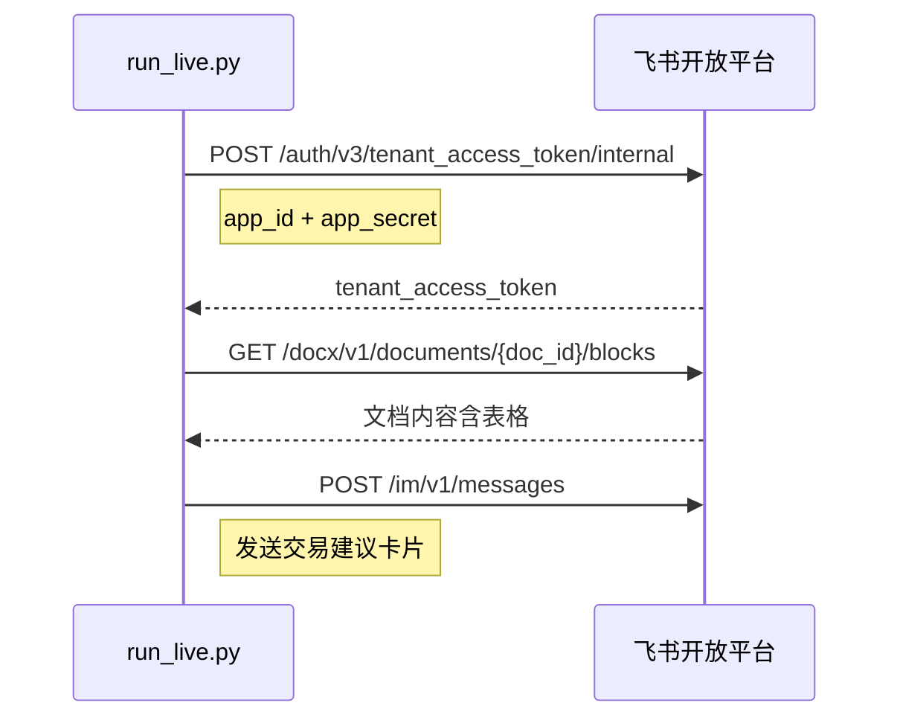
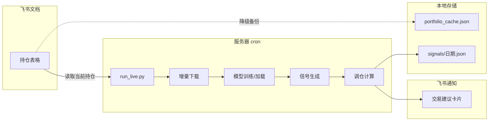

# HS300 Top-10 V1.3 生产化执行方案

## 核心问题

当前 `PipelineConfig` 所有日期硬编码，且流水线只支持"全量回测"模式。生产环境需要：
- 日期自动跟随当前时间
- 每周一开盘前生成本周交易建议
- 每月初自动重训模型
- 输出结构化的交易指令（后续对接推送）

## 方案设计

### 1. PipelineConfig 动态化

修改 [pipeline_config.py](hs300_top10/pipeline_config.py)，支持两种模式：

```python
@dataclass(frozen=True)
class PipelineConfig:
    lab_path: str = "./lab/hs300"
    # 固定起点（历史数据不变）
    data_start: str = "2016-04-30"
    # 以下字段支持 "auto" → 运行时计算
    data_end: str = "auto"         # auto = 今天
    backtest_start: str = "auto"   # auto = data_end - 2年
    backtest_end: str = "auto"     # auto = 今天
    capital: int = 100_000
    benchmark: str = "000300.SSE"
    train_years: int = 8

    def resolve(self) -> ResolvedConfig:
        """将 auto 占位符解析为实际日期"""
```

- `"auto"` 在调用 `.resolve()` 时根据 `date.today()` 计算
- 回测模式可以传入固定日期覆盖（向下兼容）
- 新增 `ResolvedConfig` 命名元组，所有下游使用解析后的值

### 2. 新增 `run_live.py` — 生产执行入口

```
hs300_top10/
  run_pipeline.py    ← 保持不动（回测/研究用）
  run_live.py        ← 新增（生产用）
```

**执行流程图：**



### 3. Phase 3 — 增量信号生成

当前 `rolling_train` 是批量为整个回测期生成信号。生产中只需要"本周一"的信号：

在 [rolling_trainer.py](hs300_top10/model/rolling_trainer.py) 中新增：

```python
def predict_live(
    target_date: date,            # 本周一
    lab_path: str = ...,
    data_start: str = ...,
    train_years: int = 8,
) -> pl.DataFrame:
    """为单个目标日期生成信号（复用 _load_features + 已训练模型）。

    1. 加载特征矩阵
    2. 训练截止日 = target_date - label_gap
    3. 训练 XGBoost
    4. 预测 target_date 当天所有股票的信号概率
    5. 返回 DataFrame(vt_symbol, signal)
    """
```

### 4. 飞书集成 — 持仓读取 + 消息推送

新建 [hs300_top10/live/feishu.py](hs300_top10/live/feishu.py)：

**飞书 API 客户端，封装两个核心能力：**

- `FeishuClient(app_id, app_secret)` — 自动获取 tenant_access_token
- `read_doc_table(document_id, table_index)` — 读取飞书文档内嵌表格，解析为持仓数据
- `send_card_message(chat_id, card)` — 向群/个人发送富文本卡片消息

**认证流程：**



凭证通过环境变量 `FEISHU_APP_ID` / `FEISHU_APP_SECRET` 传入，不硬编码。

### 5. Phase 4/5 — 持仓状态 + 差异计算

新建 [hs300_top10/live/portfolio.py](hs300_top10/live/portfolio.py)：

**持仓数据源：飞书文档内嵌表格**

你在飞书文档中维护一个表格，格式如下：

| 股票代码 | 股票名称 | 持仓数量 | 成本价 | 买入日期 | 备注 |
|----------|----------|----------|--------|----------|------|
| 300394   | 天孚通信 | 200      | 25.30  | 2026-04-28 | |
| 600519   | 贵州茅台 | 100      | 1850.00| 2026-04-21 | |

另起一行记录可用现金：

| 可用现金 | 85000 |

**手动调仓后，你只需要在飞书文档里更新表格，系统自动读取最新状态。**

模块功能：

- `load_portfolio_from_feishu(doc_id)` — 调用飞书 API 读取文档表格 → 解析为 `Portfolio` 对象
- `load_portfolio_local(path)` — 备用：从本地 JSON 读取（飞书不可用时的降级方案）
- `save_portfolio_local(portfolio, path)` — 将飞书读取的快照缓存到本地
- `compute_rebalance(portfolio, top_k_signals, capital, config)` — 输入当前持仓 + 新信号 Top-K → 输出买卖清单

`Portfolio` 数据结构：

```python
@dataclass
class Position:
    symbol: str          # "300394.SZSE"
    name: str            # "天孚通信"
    shares: int          # 200
    cost: float          # 25.30
    entry_date: str      # "2026-04-28"

@dataclass
class Portfolio:
    cash: float
    positions: list[Position]
    cooldowns: dict[str, int]   # symbol -> 剩余冷却天数
    updated_at: str
```

### 6. Phase 6 — 交易建议输出

输出到 `live/signals/YYYY-MM-DD.json`，同时格式化为飞书消息卡片。

**JSON 结构（增强版）：**

```json
{
  "date": "2026-05-05",
  "strategy": "v1.3",
  "portfolio_before": {
    "cash": 85000,
    "total_value": 156800,
    "position_count": 8
  },
  "actions": [
    {
      "symbol": "300394.SZSE",
      "name": "天孚通信",
      "action": "BUY",
      "shares": 200,
      "ref_price": 25.80,
      "estimated_cost": 5160.00,
      "reason": "new_entry",
      "signal_prob": 0.72,
      "signal_rank": 2
    },
    {
      "symbol": "002384.SZSE",
      "name": "东山精密",
      "action": "SELL",
      "shares": 300,
      "ref_price": 18.50,
      "estimated_proceeds": 5550.00,
      "current_pnl_pct": -3.2,
      "reason": "rebalance_out",
      "signal_prob": 0.31,
      "signal_rank": 45
    },
    {
      "symbol": "600519.SSE",
      "name": "贵州茅台",
      "action": "HOLD",
      "shares": 100,
      "ref_price": 1860.00,
      "current_pnl_pct": 0.5,
      "reason": "still_top_k",
      "signal_prob": 0.65,
      "signal_rank": 5
    }
  ],
  "top_k_ranking": [
    {"rank": 1, "symbol": "688506.SSE", "name": "百济神州", "signal": 0.78},
    {"rank": 2, "symbol": "300394.SZSE", "name": "天孚通信", "signal": 0.72}
  ],
  "summary": {
    "buys": 2,
    "sells": 3,
    "holds": 5,
    "estimated_turnover": 21600.00
  },
  "model_info": {
    "train_cutoff": "2026-03-31",
    "train_samples": 158000,
    "signal_date": "2026-05-05"
  }
}
```

**关键字段说明：**

- `ref_price` — 上一交易日收盘价，作为买卖参考价
- `estimated_cost / estimated_proceeds` — 预估买入成本 / 卖出回款（= ref_price x shares）
- `current_pnl_pct` — 当前持仓浮动盈亏百分比（= ref_price / cost - 1）
- `signal_rank` — 该股票在全部候选池中的信号排名
- `summary` — 汇总统计，便于快速浏览

### 7. Phase 7 — 飞书消息推送

将交易建议格式化为飞书**交互式卡片消息**，推送到指定群或个人：

```
┌─────────────────────────────────────┐
│  HS300 V1.3 周度调仓建议            │
│  2026-05-05 (周一)                  │
├─────────────────────────────────────┤
│  买入 (2只)                         │
│  ● 天孚通信 300394 | 200股 | ~25.80 │
│  ● 百济神州 688506 | 100股 | ~178.5 │
│                                     │
│  卖出 (3只)                         │
│  ● 东山精密 002384 | 300股 | -3.2%  │
│  ● 三花智控 002050 | 200股 | +1.8%  │
│  ● 中际旭创 300308 | 100股 | -5.1%  │
│                                     │
│  继续持有 (5只)                      │
│  ● 贵州茅台 600519 | 100股 | +0.5%  │
│  ● ...                              │
├─────────────────────────────────────┤
│  预估换手: 21,600 | 账户总值: 156,800│
│  模型训练截止: 2026-03-31            │
└─────────────────────────────────────┘
```

配置项：`FEISHU_CHAT_ID`（推送目标群/个人 ID）通过环境变量传入。
```

### 6. Cron 调度

```bash
# /etc/crontab 或 crontab -e

# 每个交易日 8:30 执行（周一~周五）
30 8 * * 1-5  cd /path/to/vnpy && .venv/bin/python -m hs300_top10.run_live 2>&1 >> live/logs/live.log

# 每月 1 号 7:00 强制重训（如果 1 号非交易日，run_live 内部判断跳到下个交易日）
0 7 1 * *  cd /path/to/vnpy && .venv/bin/python -m hs300_top10.run_live --retrain 2>&1 >> live/logs/retrain.log
```

`run_live.py` 的 CLI 接口：

```bash
python -m hs300_top10.run_live                    # 正常执行（自动判断是否调仓日）
python -m hs300_top10.run_live --retrain           # 强制重训模型
python -m hs300_top10.run_live --dry-run           # 只计算信号，不更新持仓状态
python -m hs300_top10.run_live --date 2026-05-05   # 指定日期（调试用）
```

### 8. 目录结构

```
hs300_top10/
  pipeline_config.py       <- 改: 支持 auto 日期
  run_pipeline.py          <- 不动（回测用）
  run_live.py              <- 新: 生产执行入口
  live/                    <- 新: 生产运行时目录
    __init__.py
    feishu.py              <- 飞书 API 客户端
    portfolio.py           <- 持仓管理（飞书文档 + 本地缓存）
    signal_generator.py    <- 增量信号生成
    state/
      portfolio_cache.json <- 飞书持仓的本地快照（降级备用）
    signals/
      2026-05-05.json      <- 每日交易建议
    logs/
      live.log             <- 执行日志
```

### 9. 环境变量

```bash
# .env 或服务器环境配置（不入 git）
FEISHU_APP_ID=cli_xxxxxxxxxxxx
FEISHU_APP_SECRET=xxxxxxxxxxxxxxxxxxxxxxxx
FEISHU_DOC_ID=xxxxxxxxxxxxxxxx          # 持仓文档 ID
FEISHU_CHAT_ID=oc_xxxxxxxxxxxxxxxx      # 推送目标群 ID
```

### 10. 向下兼容

- `PIPELINE = PipelineConfig()` 保持原有默认值（硬编码日期）
- 所有现有代码仍然通过 `PIPELINE` 使用固定日期 -> 回测不受影响
- `run_live.py` 构造 `PipelineConfig(data_end="auto")` 然后 `.resolve()` -> 使用动态日期
- 现有 `rolling_train` / `phase_download` 的函数签名不变，通过参数传入解析后的日期
- 飞书不可用时自动降级到本地 `portfolio_cache.json`

### 11. 数据流总览



你在收到飞书通知后手动执行买卖，然后更新飞书文档中的持仓表格，形成闭环。
