# VeighNa (vnpy) 项目全景文档

> **面向读者**: 熟悉 Java/Kotlin 的 Android 开发者，对 Python 项目结构不太熟悉。
> 本文档用 Android 开发者熟悉的概念来类比，帮助你快速建立对 VeighNa 量化交易框架的全面理解。

---

## 目录

- [Part 1: Python 环境与项目构建](#part-1-python-环境与项目构建)
- [Part 2: 项目目录结构总览](#part-2-项目目录结构总览)
- [Part 3: 核心架构 -- 引擎-事件-网关](#part-3-核心架构----引擎-事件-网关)
- [Part 4: UI 层 -- Qt 桌面客户端](#part-4-ui-层----qt-桌面客户端)
- [Part 5: RPC 模块 -- 跨进程通信](#part-5-rpc-模块----跨进程通信)
- [Part 6: Chart 模块 -- K 线图表](#part-6-chart-模块----k-线图表)
- [Part 7: Alpha 模块 -- AI 量化研究](#part-7-alpha-模块----ai-量化研究)
- [Part 8: 业务全景 -- 从量化交易员视角理解系统](#part-8-业务全景----从量化交易员视角理解系统)
- [Part 9: 设计模式速查](#part-9-设计模式速查)
- [Part 10: 术语表](#part-10-术语表)

---

## Part 1: Python 环境与项目构建

### 1.1 这是什么

VeighNa (vnpy) 是一个**开源量化交易系统开发框架**，用 Python 编写。它做的事情可以类比为：你用 Java/Kotlin 写一个 Android 股票交易 App，但 VeighNa 是一个**桌面端+服务端的量化交易平台**，直接对接券商/期货公司的交易接口，支持自动化策略交易。

### 1.2 Python 项目 vs Android 项目：对照表

如果你熟悉 Android 项目的 Gradle 构建体系，可以通过下表快速理解 Python 项目的对应关系：

| Android / Gradle | Python / VeighNa | 说明 |
|---|---|---|
| `build.gradle` + `settings.gradle` | `pyproject.toml` | 项目元数据、依赖声明、构建配置，全部集中在一个文件 |
| AGP (Android Gradle Plugin) | Hatchling | 构建后端，负责把源码打包成可安装的 wheel 包 |
| `dependencies { }` | `[project] dependencies` | 运行时依赖列表 |
| `productFlavors` / `buildTypes` | `[project.optional-dependencies]` | 可选依赖组，如 `alpha` (AI模块), `dev` (开发工具) |
| `compileSdkVersion 34` | `requires-python = ">=3.10"` | 最低 Python 版本要求 |
| `versionName "1.0"` | `__version__ = "4.3.0"` (在 `vnpy/__init__.py`) | 版本号，Hatch 从源码动态读取 |
| `SharedPreferences` 存储目录 | `.vntrader/` 目录 (用户 home 下) | 运行时配置、日志、JSON 设置文件存放处 |
| `gradle wrapper` / `gradlew` | `install.sh` / `install.bat` | 一键安装脚本 |
| Maven Central / Google Maven | PyPI / `pip.vnpy.com` | 包管理仓库 |
| `./gradlew assembleDebug` | `pip install .` 或 `uv build` | 构建/安装命令 |

### 1.3 pyproject.toml 详解

`pyproject.toml` 是整个项目的**唯一构建配置文件**（类似把 `build.gradle`、`settings.gradle`、`gradle.properties` 合为一体）：

```toml
[project]
name = "vnpy"
dynamic = ["version"]           # 版本号从 vnpy/__init__.py 动态读取
requires-python = ">=3.10"      # 最低 Python 3.10

dependencies = [                # 核心运行依赖 (类似 implementation)
    "PySide6==6.8.2.1",         # Qt GUI 框架 (类比 Android View 系统)
    "pyqtgraph>=0.13.7",        # 高性能图表库
    "numpy>=2.2.3",             # 数值计算 (类比 Java 数组运算)
    "pandas>=2.2.3",            # 表格数据处理
    "ta-lib>=0.6.4",            # 技术分析指标库
    "pyzmq>=26.3.0",            # ZeroMQ 消息队列 (用于 RPC)
    "plotly>=6.0.0",            # 交互式图表
    "loguru>=0.7.3",            # 日志框架 (类比 Timber)
]

[project.optional-dependencies]
alpha = [                       # AI 量化模块的额外依赖 (类比 flavor)
    "polars>=1.26.0",           # 高性能 DataFrame (比 pandas 更快)
    "torch>=2.6.0",             # PyTorch 深度学习
    "lightgbm>=4.6.0",          # 梯度提升树
    "scikit-learn>=1.6.1",      # 机器学习工具包
]

[build-system]
requires = ["hatchling>=1.27.0"]
build-backend = "hatchling.build"  # 构建后端 (类比 AGP)
```

**安装方式**：
- 基础安装: `pip install .` (类似 `./gradlew installDebug`)
- 带 AI 模块: `pip install ".[alpha]"` (类似 `./gradlew installAlphaDebug`)
- 开发模式: `pip install -e ".[alpha,dev]"` (类似 `installDebug` + 热更新)

### 1.4 关键依赖一览

| 依赖 | 角色 | Android 类比 |
|---|---|---|
| PySide6 | Qt GUI 框架，提供窗口/按钮/表格等控件 | Android SDK View 体系 |
| pyqtgraph | 基于 Qt 的高性能实时图表 | MPAndroidChart |
| numpy | N 维数组运算 | 无直接对应，类似高性能数组 |
| pandas | 表格数据处理 (行列数据) | 类似 Room 查询结果的 List<Entity> |
| polars | 更快的 DataFrame (用于 alpha 模块) | 类似 pandas 的高性能替代 |
| ta-lib | 技术分析指标 (MA/MACD/RSI 等) | 量化领域专用库 |
| pyzmq | ZeroMQ 消息队列 | AIDL / gRPC |
| loguru | 结构化日志 | Timber / android.util.Log |
| deap | 遗传算法库 (用于参数优化) | 无直接对应 |

### 1.5 .vntrader 目录

程序运行时，会在用户 home 目录下创建 `.vntrader/` 文件夹（类似 Android 的 `data/data/包名/`）：

```
~/.vntrader/
├── vt_setting.json      # 全局配置 (类似 SharedPreferences)
├── connect_CTP.json     # CTP 网关连接配置
├── connect_IB.json      # IB 网关连接配置
└── ...                  # 其他运行时文件
```

---

## Part 2: 项目目录结构总览

### 2.1 顶层目录树

```
vnpy/                          # 根目录 (类似 Android 的 project/)
│
├── vnpy/                      # 主 Python 包 (类似 app/src/main/java/)
│   ├── __init__.py            # 包入口，定义 __version__ = "4.3.0"
│   ├── trader/                # 核心交易引擎 (类似 app 模块的 core 层)
│   │   ├── engine.py          # 主引擎 MainEngine + OMS + Log + Email 引擎
│   │   ├── gateway.py         # 网关抽象基类 BaseGateway
│   │   ├── app.py             # 应用插件基类 BaseApp
│   │   ├── object.py          # 数据模型 (TickData, OrderData 等 dataclass)
│   │   ├── event.py           # 事件类型常量 (EVENT_TICK, EVENT_ORDER 等)
│   │   ├── constant.py        # 枚举常量 (Direction, Exchange, Status 等)
│   │   ├── database.py        # 数据库抽象接口 + 工厂
│   │   ├── datafeed.py        # 数据服务抽象接口 + 工厂
│   │   ├── setting.py         # 全局配置 SETTINGS 字典
│   │   ├── converter.py       # 委托转换器 (期货平今/平昨)
│   │   ├── utility.py         # 工具类 (路径、JSON、K线生成器、技术指标)
│   │   ├── optimize.py        # 参数优化 (网格搜索 + 遗传算法)
│   │   ├── logger.py          # loguru 日志配置
│   │   ├── locale/            # 国际化翻译 (中英文)
│   │   └── ui/                # Qt 桌面界面
│   │       ├── mainwindow.py  # 主窗口
│   │       ├── widget.py      # 通用 UI 组件 (表格、对话框等)
│   │       └── qt.py          # Qt 初始化辅助
│   │
│   ├── event/                 # 事件驱动引擎 (类似 Android 的 Handler/Looper)
│   │   └── engine.py          # Event 类 + EventEngine 类
│   │
│   ├── rpc/                   # 跨进程 RPC 通信 (基于 ZeroMQ)
│   │   ├── server.py          # RPC 服务端
│   │   ├── client.py          # RPC 客户端
│   │   └── common.py          # 心跳常量
│   │
│   ├── chart/                 # K 线图表组件
│   │   ├── widget.py          # ChartWidget 主控件
│   │   ├── item.py            # CandleItem / VolumeItem 图形元素
│   │   ├── manager.py         # BarManager 数据管理
│   │   └── axis.py            # 时间轴
│   │
│   └── alpha/                 # AI 量化研究模块 (4.0 新增重点)
│       ├── lab.py             # AlphaLab 研究工作区管理
│       ├── logger.py          # alpha 专用日志
│       ├── dataset/           # 因子特征工程
│       │   ├── template.py    # AlphaDataset 模板
│       │   ├── processor.py   # 数据处理器 (归一化等)
│       │   ├── utility.py     # 表达式引擎 + 工具
│       │   ├── ts_function.py # 时序函数 (ts_delay, ts_corr 等)
│       │   ├── cs_function.py # 截面函数 (cs_rank, cs_mean 等)
│       │   ├── ta_function.py # 技术分析函数
│       │   ├── math_function.py # 数学函数
│       │   └── datasets/      # 预置因子集
│       │       ├── alpha_101.py   # WorldQuant Alpha 101
│       │       └── alpha_158.py   # Qlib Alpha 158
│       ├── model/             # 预测模型
│       │   ├── template.py    # AlphaModel 抽象基类
│       │   └── models/        # 具体模型实现
│       │       ├── lasso_model.py  # Lasso 回归
│       │       ├── lgb_model.py    # LightGBM
│       │       └── mlp_model.py    # MLP 神经网络
│       └── strategy/          # 策略回测
│           ├── template.py    # AlphaStrategy 策略模板
│           ├── backtesting.py # BacktestingEngine 回测引擎
│           └── strategies/    # 示例策略
│               └── equity_demo_strategy.py
│
├── examples/                  # 示例代码 (类似 Android sample/)
│   ├── veighna_trader/        # GUI 启动示例
│   ├── no_ui/                 # 无界面启动示例
│   ├── alpha_research/        # AI 量化研究 Jupyter Notebook
│   ├── cta_backtesting/       # CTA 策略回测示例
│   └── ...
│
├── tests/                     # 单元测试
├── docs/                      # Sphinx 文档源码
├── pyproject.toml             # 构建配置 (上文已详述)
├── install.sh                 # Linux 安装脚本
├── install_osx.sh             # macOS 安装脚本
├── install.bat                # Windows 安装脚本
├── README.md                  # 项目说明 (中文)
├── README_ENG.md              # 项目说明 (英文)
├── CHANGELOG.md               # 变更日志
└── LICENSE                    # MIT 许可证
```

### 2.2 Python 包的概念 (对比 Android)

| Python 概念 | Android 对应 | 说明 |
|---|---|---|
| `包 (package)` = 含 `__init__.py` 的目录 | Java 包 (package) | `vnpy/event/` = `com.vnpy.event` |
| `模块 (module)` = 单个 `.py` 文件 | Java 类文件 | `engine.py` = `Engine.java` |
| `__init__.py` | 包的公开 API | 决定 `from vnpy.event import X` 能导出什么 |
| `import` 语句 | Java `import` | 功能完全相同 |
| `pip install` | Gradle `implementation` | 安装第三方依赖 |

### 2.3 外部插件生态

VeighNa 的核心代码在本仓库内，但**交易网关和应用模块以独立 pip 包发布**（类似 Android 的 AAR 库）：

| 外部包 | 功能 | 类比 |
|---|---|---|
| `vnpy_ctp` | CTP 期货交易接口 | 类似 OkHttp 适配器 |
| `vnpy_ib` | Interactive Brokers 国际证券 | 另一个适配器 |
| `vnpy_ctastrategy` | CTA 策略引擎 | 类似一个功能模块 AAR |
| `vnpy_sqlite` | SQLite 数据库适配 | Room 实现 |
| `vnpy_rqdata` | RQData 行情数据源 | 数据源 SDK |

这些外部包通过 `main_engine.add_gateway()` 和 `main_engine.add_app()` 注册到系统中。

---

## Part 3: 核心架构 -- 引擎-事件-网关

### 3.1 整体架构图

VeighNa 的核心是一个**事件驱动架构**，可以用三层模型来理解：

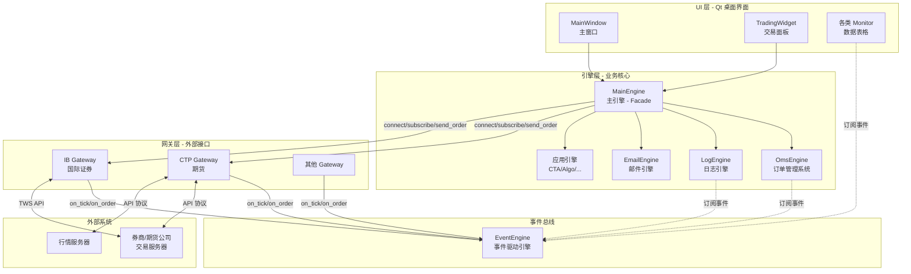
```mermaid
graph TB
    subgraph UILayer ["UI 层 - Qt 桌面界面"]
        MW["MainWindow<br/>主窗口"]
        TW["TradingWidget<br/>交易面板"]
        Monitors["各类 Monitor<br/>数据表格"]
    end

    subgraph EngineLayer ["引擎层 - 业务核心"]
        ME["MainEngine<br/>主引擎 - Facade"]
        OMS["OmsEngine<br/>订单管理系统"]
        LOG["LogEngine<br/>日志引擎"]
        EMAIL["EmailEngine<br/>邮件引擎"]
        APPS["应用引擎<br/>CTA/Algo/..."]
    end

    subgraph EventBus ["事件总线"]
        EE["EventEngine<br/>事件驱动引擎"]
    end

    subgraph GatewayLayer ["网关层 - 外部接口"]
        CTP["CTP Gateway<br/>期货"]
        IB["IB Gateway<br/>国际证券"]
        OTHER["其他 Gateway"]
    end

    subgraph External ["外部系统"]
        Broker["券商/期货公司<br/>交易服务器"]
        Market["行情服务器"]
    end

    MW --> ME
    TW --> ME
    Monitors -.->|"订阅事件"| EE

    ME --> OMS
    ME --> LOG
    ME --> EMAIL
    ME --> APPS

    OMS -.->|"订阅事件"| EE
    LOG -.->|"订阅事件"| EE

    CTP -->|"on_tick/on_order"| EE
    IB -->|"on_tick/on_order"| EE
    OTHER -->|"on_tick/on_order"| EE

    ME -->|"connect/subscribe/send_order"| CTP
    ME -->|"connect/subscribe/send_order"| IB

    CTP <-->|"API 协议"| Broker
    CTP <-->|"API 协议"| Market
    IB <-->|"TWS API"| Broker
```

**Android 类比对照**:

| VeighNa 组件 | Android 类比 | 核心职责 |
|---|---|---|
| `EventEngine` | `Handler + Looper + MessageQueue` | 线程安全的事件分发中枢 |
| `MainEngine` | `Application` 单例 | 系统门面，管理所有组件生命周期 |
| `BaseGateway` | `Retrofit` 网络接口 | 适配不同交易 API 为统一格式 |
| `OmsEngine` | `ViewModel` + 内存缓存 | 维护最新的市场和账户状态 |
| `BaseApp` | AAR 插件描述符 | 声明式的功能模块注册 |
| `BaseMonitor` | `RecyclerView.Adapter` | 通用数据表格组件 |

### 3.2 EventEngine -- 事件驱动引擎

#### 3.2.1 这是什么

`EventEngine` 是整个系统的**消息中枢**，类似 Android 的 `Handler/Looper` 机制。所有组件之间不直接调用，而是通过发送/订阅事件来通信。

#### 3.2.2 核心类

**`Event` 类** -- 事件对象（类似 Android 的 `Message`）:

```python
class Event:
    def __init__(self, type: str, data: Any = None):
        self.type: str = type    # 事件类型字符串 (路由键)
        self.data: Any = data    # 事件携带的数据
```

**`EventEngine` 类** -- 事件引擎（类似 `Looper` + `Handler`）:

```python
class EventEngine:
    def __init__(self, interval: int = 1):
        self._queue: Queue = Queue()              # 事件队列 (类似 MessageQueue)
        self._thread: Thread = Thread(target=self._run)   # 分发线程
        self._timer: Thread = Thread(target=self._run_timer)  # 定时器线程
        self._handlers: defaultdict = defaultdict(list)       # 事件处理器注册表
        self._general_handlers: list = []                     # 全局处理器
```

#### 3.2.3 线程模型

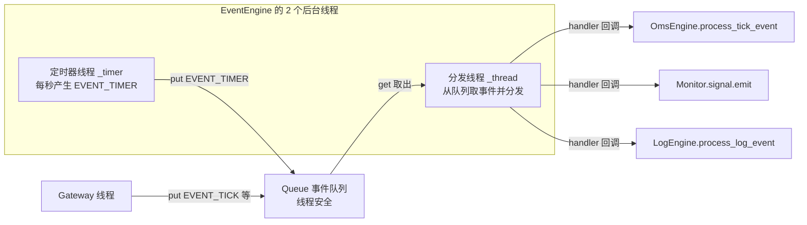
```mermaid
graph LR
    subgraph Threads ["EventEngine 的 2 个后台线程"]
        T1["分发线程 _thread<br/>从队列取事件并分发"]
        T2["定时器线程 _timer<br/>每秒产生 EVENT_TIMER"]
    end

    Q["Queue 事件队列<br/>线程安全"]

    T2 -->|"put EVENT_TIMER"| Q
    GW["Gateway 线程"] -->|"put EVENT_TICK 等"| Q
    Q -->|"get 取出"| T1
    T1 -->|"handler 回调"| H1["OmsEngine.process_tick_event"]
    T1 -->|"handler 回调"| H2["Monitor.signal.emit"]
    T1 -->|"handler 回调"| H3["LogEngine.process_log_event"]
```

**关键点**:
- 只有 **1 个分发线程**，所有 handler 在同一线程上串行执行（类似 Android 主线程的 `Looper`）
- 如果某个 handler 执行过慢，会阻塞整个事件分发
- `put()` 方法是线程安全的，任何线程都可以往队列里塞事件

#### 3.2.4 事件类型

所有事件类型定义在 `vnpy/trader/event.py` 中，都是字符串常量：

| 事件类型 | 值 | 触发时机 | 携带数据 |
|---|---|---|---|
| `EVENT_TICK` | `"eTick."` | 收到行情快照 | `TickData` |
| `EVENT_ORDER` | `"eOrder."` | 委托状态变化 | `OrderData` |
| `EVENT_TRADE` | `"eTrade."` | 成交回报 | `TradeData` |
| `EVENT_POSITION` | `"ePosition."` | 持仓变化 | `PositionData` |
| `EVENT_ACCOUNT` | `"eAccount."` | 账户资金变化 | `AccountData` |
| `EVENT_CONTRACT` | `"eContract."` | 合约信息更新 | `ContractData` |
| `EVENT_LOG` | `"eLog"` | 日志消息 | `LogData` |
| `EVENT_QUOTE` | `"eQuote."` | 报价状态变化 | `QuoteData` |
| `EVENT_TIMER` | `"eTimer"` | 每秒定时触发 | `None` |

**注意末尾的 `.`**: 带 `.` 的事件类型支持**细粒度订阅**。比如 Gateway 会同时发布 `EVENT_TICK`（所有行情）和 `EVENT_TICK + vt_symbol`（如 `"eTick.rb2501.SHFE"`，只有螺纹钢 2501 合约的行情），这样策略可以精准订阅自己关心的合约。

#### 3.2.5 注册/分发 API（对比 Android BroadcastReceiver）

| EventEngine 方法 | Android 类比 | 说明 |
|---|---|---|
| `register(type, handler)` | `registerReceiver(filter, receiver)` | 注册特定事件的处理器 |
| `unregister(type, handler)` | `unregisterReceiver(receiver)` | 注销处理器 |
| `register_general(handler)` | 注册一个接收所有广播的 Receiver | 监听所有事件类型 |
| `put(event)` | `sendBroadcast(intent)` | 发送事件到队列 |

#### 3.2.6 事件完整生命周期时序图

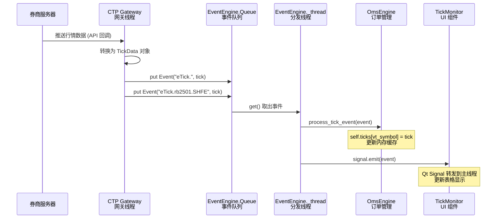
```mermaid
sequenceDiagram
    participant Broker as 券商服务器
    participant GW as CTP Gateway<br/>网关线程
    participant Q as EventEngine.Queue<br/>事件队列
    participant Dispatch as EventEngine._thread<br/>分发线程
    participant OMS as OmsEngine<br/>订单管理
    participant UI as TickMonitor<br/>UI 组件

    Broker->>GW: 推送行情数据 (API 回调)
    GW->>GW: 转换为 TickData 对象
    GW->>Q: put Event("eTick.", tick)
    GW->>Q: put Event("eTick.rb2501.SHFE", tick)

    Q->>Dispatch: get() 取出事件
    Dispatch->>OMS: process_tick_event(event)
    Note over OMS: self.ticks[vt_symbol] = tick<br/>更新内存缓存
    Dispatch->>UI: signal.emit(event)
    Note over UI: Qt Signal 转发到主线程<br/>更新表格显示
```

### 3.3 MainEngine -- 系统门面

#### 3.3.1 这是什么

`MainEngine` 是整个系统的**门面（Facade）**，类似 Android 的 `Application` 单例。它不直接实现业务逻辑，而是**协调和管理所有组件**。

#### 3.3.2 生命周期

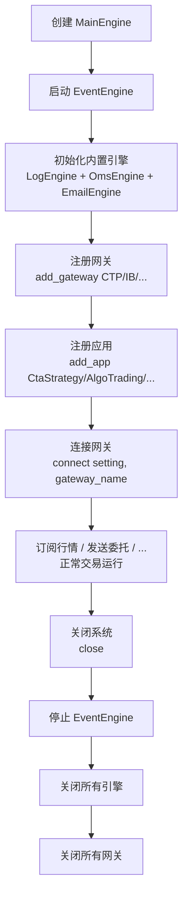
```mermaid
graph TD
    A["创建 MainEngine"] --> B["启动 EventEngine"]
    B --> C["初始化内置引擎<br/>LogEngine + OmsEngine + EmailEngine"]
    C --> D["注册网关<br/>add_gateway CTP/IB/..."]
    D --> E["注册应用<br/>add_app CtaStrategy/AlgoTrading/..."]
    E --> F["连接网关<br/>connect setting, gateway_name"]
    F --> G["订阅行情 / 发送委托 / ...<br/>正常交易运行"]
    G --> H["关闭系统<br/>close"]
    H --> I["停止 EventEngine"]
    I --> J["关闭所有引擎"]
    J --> K["关闭所有网关"]
```

**对比 Android Activity 生命周期**: `MainEngine` 的 `__init__` 类似 `onCreate`，`close()` 类似 `onDestroy`，但 `MainEngine` 是**整个应用只有一个实例**。

#### 3.3.3 组件注册机制

`MainEngine` 内部维护三个注册表（类似 Android 的 `ServiceManager`）：

```python
self.gateways: dict[str, BaseGateway] = {}  # 网关注册表
self.engines: dict[str, BaseEngine] = {}     # 引擎注册表
self.apps: dict[str, BaseApp] = {}           # 应用注册表
```

注册流程:

```python
# 1. 注册网关 (类似 Retrofit 注册接口)
main_engine.add_gateway(CtpGateway)    # 实例化并存入 self.gateways

# 2. 注册应用 (应用 = 元数据 + 引擎)
main_engine.add_app(CtaStrategyApp)    # 存储 app 元数据，并实例化其引擎
```

#### 3.3.4 方法代理模式

`MainEngine.init_engines()` 中，将 `OmsEngine` 的方法直接绑定到 `MainEngine` 上，使外部调用者不需要知道 OMS 的存在：

```python
# init_engines() 中的代理绑定，类似 Kotlin 的 by 委托
oms_engine = self.add_engine(OmsEngine)
self.get_tick = oms_engine.get_tick        # MainEngine.get_tick() 直接调用 OMS
self.get_order = oms_engine.get_order
self.send_email = email_engine.send_email  # 同样代理邮件功能
```

### 3.4 BaseGateway -- 交易接口适配器

#### 3.4.1 这是什么

`BaseGateway` 是所有交易接口的**抽象基类**，类似 Retrofit 的接口定义。每个具体的券商/交易所 API 都需要继承它并实现抽象方法。

#### 3.4.2 抽象方法（子类必须实现）

```python
class BaseGateway(ABC):
    @abstractmethod
    def connect(self, setting: dict) -> None: ...    # 连接交易服务器
    @abstractmethod
    def close(self) -> None: ...                      # 关闭连接
    @abstractmethod
    def subscribe(self, req: SubscribeRequest) -> None: ...  # 订阅行情
    @abstractmethod
    def send_order(self, req: OrderRequest) -> str: ...      # 发送委托
    @abstractmethod
    def cancel_order(self, req: CancelRequest) -> None: ...  # 撤销委托
    @abstractmethod
    def query_account(self) -> None: ...              # 查询账户
    @abstractmethod
    def query_position(self) -> None: ...             # 查询持仓
```

#### 3.4.3 回调方法（数据上报）

Gateway 在收到交易所数据后，通过 `on_*` 方法将数据推送到 EventEngine：

```python
def on_tick(self, tick: TickData) -> None:
    self.on_event(EVENT_TICK, tick)                   # 广播给所有订阅者
    self.on_event(EVENT_TICK + tick.vt_symbol, tick)  # 精确推送给特定合约

def on_order(self, order: OrderData) -> None:
    self.on_event(EVENT_ORDER, order)
    self.on_event(EVENT_ORDER + order.vt_orderid, order)
```

#### 3.4.4 Gateway 的工作模式时序图

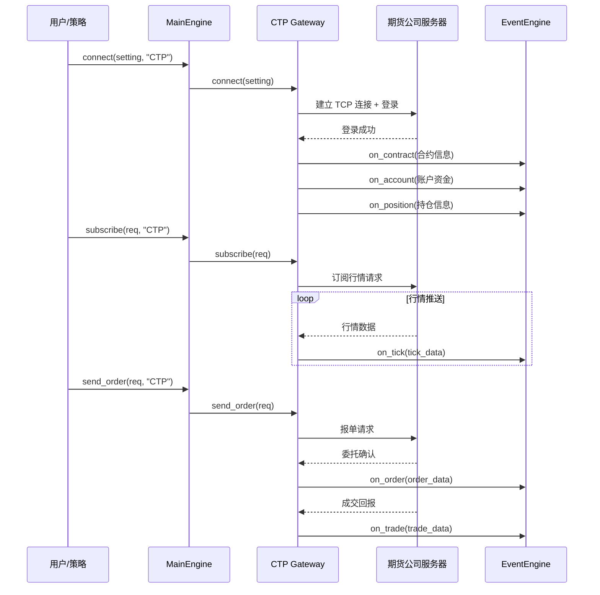
```mermaid
sequenceDiagram
    participant User as 用户/策略
    participant ME as MainEngine
    participant GW as CTP Gateway
    participant Server as 期货公司服务器
    participant EE as EventEngine

    User->>ME: connect(setting, "CTP")
    ME->>GW: connect(setting)
    GW->>Server: 建立 TCP 连接 + 登录
    Server-->>GW: 登录成功
    GW->>EE: on_contract(合约信息)
    GW->>EE: on_account(账户资金)
    GW->>EE: on_position(持仓信息)

    User->>ME: subscribe(req, "CTP")
    ME->>GW: subscribe(req)
    GW->>Server: 订阅行情请求

    loop 行情推送
        Server-->>GW: 行情数据
        GW->>EE: on_tick(tick_data)
    end

    User->>ME: send_order(req, "CTP")
    ME->>GW: send_order(req)
    GW->>Server: 报单请求
    Server-->>GW: 委托确认
    GW->>EE: on_order(order_data)
    Server-->>GW: 成交回报
    GW->>EE: on_trade(trade_data)
```

### 3.5 OmsEngine -- 订单管理系统

#### 3.5.1 这是什么

`OmsEngine` 是内存中的**订单管理系统**，类似 Android ViewModel 中的 LiveData 缓存。它监听所有交易相关事件，维护最新的市场和账户状态。

#### 3.5.2 内存缓存结构

```python
class OmsEngine(BaseEngine):
    def __init__(self, ...):
        self.ticks: dict[str, TickData] = {}       # 最新行情 {vt_symbol: TickData}
        self.orders: dict[str, OrderData] = {}      # 所有委托 {vt_orderid: OrderData}
        self.trades: dict[str, TradeData] = {}      # 所有成交 {vt_tradeid: TradeData}
        self.positions: dict[str, PositionData] = {} # 持仓 {vt_positionid: PositionData}
        self.accounts: dict[str, AccountData] = {}   # 账户 {vt_accountid: AccountData}
        self.contracts: dict[str, ContractData] = {} # 合约 {vt_symbol: ContractData}
        self.active_orders: dict[str, OrderData] = {} # 活跃委托（未完成的）
        self.offset_converters: dict[str, OffsetConverter] = {} # 委托转换器
```

**类比 Android ViewModel**:
- `ticks` 相当于 `LiveData<Map<String, TickData>>`
- `orders` 相当于 `LiveData<Map<String, OrderData>>`
- 每次收到事件就更新对应的 Map 并通知观察者

#### 3.5.3 OffsetConverter -- 期货特有的委托转换

中国期货市场有特殊的**平今/平昨**规则（买入后卖出当天的持仓叫"平今"，卖出之前的持仓叫"平昨"，不同交易所手续费不同），`OffsetConverter` 负责将策略发出的简单"平仓"请求，自动拆分为符合交易所规则的具体委托。

### 3.6 数据对象模型

#### 3.6.1 这是什么

`vnpy/trader/object.py` 定义了所有的数据模型，全部使用 Python 的 `@dataclass`（类似 Kotlin 的 `data class`）。

#### 3.6.2 核心数据对象

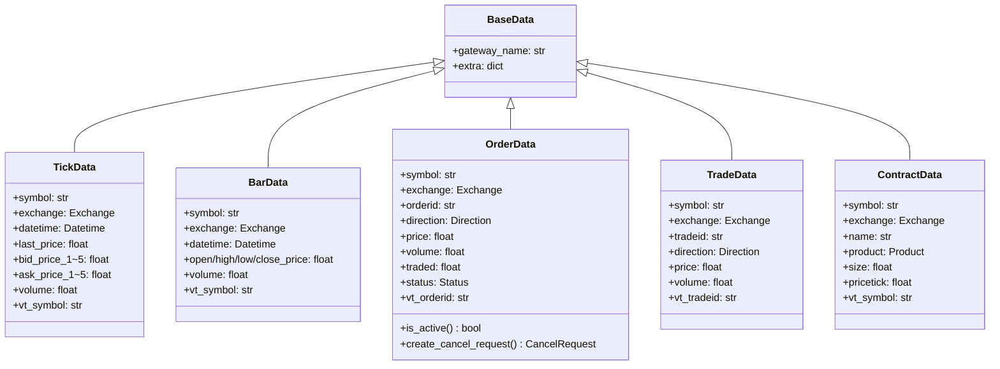
```mermaid
classDiagram
    class BaseData {
        +gateway_name: str
        +extra: dict
    }

    class TickData {
        +symbol: str
        +exchange: Exchange
        +datetime: Datetime
        +last_price: float
        +bid_price_1~5: float
        +ask_price_1~5: float
        +volume: float
        +vt_symbol: str
    }

    class BarData {
        +symbol: str
        +exchange: Exchange
        +datetime: Datetime
        +open/high/low/close_price: float
        +volume: float
        +vt_symbol: str
    }

    class OrderData {
        +symbol: str
        +exchange: Exchange
        +orderid: str
        +direction: Direction
        +price: float
        +volume: float
        +traded: float
        +status: Status
        +vt_orderid: str
        +is_active() bool
        +create_cancel_request() CancelRequest
    }

    class TradeData {
        +symbol: str
        +exchange: Exchange
        +tradeid: str
        +direction: Direction
        +price: float
        +volume: float
        +vt_tradeid: str
    }

    class ContractData {
        +symbol: str
        +exchange: Exchange
        +name: str
        +product: Product
        +size: float
        +pricetick: float
        +vt_symbol: str
    }

    BaseData <|-- TickData
    BaseData <|-- BarData
    BaseData <|-- OrderData
    BaseData <|-- TradeData
    BaseData <|-- ContractData
```

#### 3.6.3 vt_symbol 命名规则

VeighNa 使用 `vt_symbol` 作为合约的全局唯一标识：

```
vt_symbol = "{symbol}.{exchange}"
```

例如:
- `rb2501.SHFE` -- 上期所螺纹钢 2501 合约
- `000001.SSE` -- 上交所平安银行股票
- `AAPL.SMART` -- IB 的苹果股票

类似 Android 中 `packageName.className` 的命名方式，确保在多个交易所并存时不会冲突。

#### 3.6.4 Request vs Data 模式

系统中的数据流遵循**请求-数据**模式：

| Request (请求对象) | Data (数据对象) | 方向 |
|---|---|---|
| `OrderRequest` | `OrderData` | 用户 -> Gateway -> 交易所，交易所回报 -> Gateway -> 系统 |
| `CancelRequest` | -- | 用户 -> Gateway -> 交易所 |
| `SubscribeRequest` | `TickData` | 用户 -> Gateway，行情回来变成 TickData |
| `HistoryRequest` | `BarData` | 用户 -> Gateway/DataFeed，返回 K 线列表 |

`OrderRequest` 提供了 `create_order_data()` 工厂方法，Gateway 在发送委托后，用这个方法创建对应的 `OrderData` 并推送回系统。

---

## Part 4: UI 层 -- Qt 桌面客户端

### 4.1 这是什么

VeighNa 的 UI 基于 **PySide6 (Qt 6 的 Python 绑定)**，相当于 Android 开发中的 View 系统。如果你把 VeighNa 的桌面界面想象成一个复杂的 Android Activity，那么各个组件的对应关系如下：

| Qt / VeighNa | Android | 说明 |
|---|---|---|
| `QApplication` | `Application` | 全局应用对象 |
| `QMainWindow` / `MainWindow` | `Activity` | 主窗口/主界面 |
| `QDockWidget` | `Fragment` | 可拖拽、浮动的面板 |
| `QTableWidget` / `BaseMonitor` | `RecyclerView` + `Adapter` | 数据表格 |
| `QDialog` | `DialogFragment` | 弹窗对话框 |
| `Signal/Slot` 机制 | `LiveData` 观察者 | 线程安全的 UI 更新 |
| `QSettings` | `SharedPreferences` | 持久化界面状态 |

### 4.2 MainWindow -- 主窗口

`MainWindow` 继承自 `QMainWindow`，它的职责类似于 Android 的 `MainActivity`：

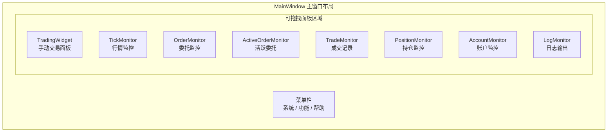
```mermaid
graph TB
    subgraph MainWindow ["MainWindow 主窗口布局"]
        Menu["菜单栏<br/>系统 / 功能 / 帮助"]
        subgraph DockArea ["可拖拽面板区域"]
            Trading["TradingWidget<br/>手动交易面板"]
            TickM["TickMonitor<br/>行情监控"]
            OrderM["OrderMonitor<br/>委托监控"]
            ActiveM["ActiveOrderMonitor<br/>活跃委托"]
            TradeM["TradeMonitor<br/>成交记录"]
            PosM["PositionMonitor<br/>持仓监控"]
            AccM["AccountMonitor<br/>账户监控"]
            LogM["LogMonitor<br/>日志输出"]
        end
    end
```

### 4.3 BaseMonitor -- 通用数据表格

`BaseMonitor` 是一个**通用的事件驱动表格组件**，类似 Android 中一个自带 LiveData 观察能力的 RecyclerView。每个 Monitor 子类通过类属性声明它关心什么：

```python
class TickMonitor(BaseMonitor):
    event_type = EVENT_TICK          # 订阅哪个事件
    data_key = "vt_symbol"           # 用哪个字段作为行的唯一 key
    headers = {                       # 列定义 (类似 Adapter ViewHolder)
        "symbol": {"display": "代码", "cell": BaseCell},
        "last_price": {"display": "最新价", "cell": BaseCell},
        "volume": {"display": "成交量", "cell": BaseCell},
    }
```

### 4.4 线程安全机制

**关键问题**: EventEngine 的分发线程不是 Qt 的 UI 线程，直接在分发线程更新 UI 会崩溃（类似 Android 在子线程更新 View）。

**解决方案**: 通过 Qt 的 Signal/Slot 跨线程机制桥接：

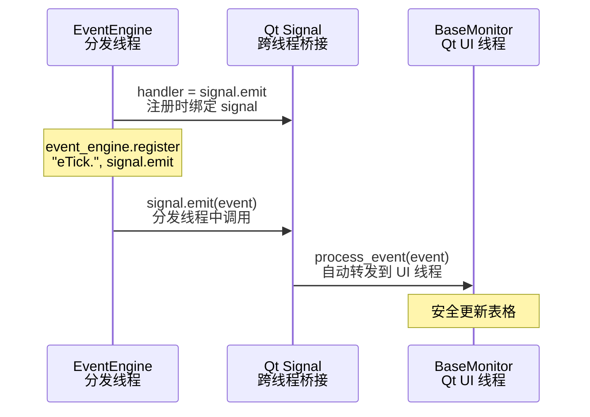
```mermaid
sequenceDiagram
    participant EE as EventEngine<br/>分发线程
    participant Sig as Qt Signal<br/>跨线程桥接
    participant UI as BaseMonitor<br/>Qt UI 线程

    EE->>Sig: handler = signal.emit<br/>注册时绑定 signal
    Note over EE: event_engine.register<br/>"eTick.", signal.emit

    EE->>Sig: signal.emit(event)<br/>分发线程中调用
    Sig->>UI: process_event(event)<br/>自动转发到 UI 线程
    Note over UI: 安全更新表格
```

这与 Android 中 `LiveData.postValue()` 或 `Handler.post(Runnable)` 的机制完全一致。

### 4.5 应用插件 UI 的动态加载

当用户安装了外部应用包（如 `vnpy_ctastrategy`）后，`MainWindow` 会动态加载其 UI 界面：

```python
# MainWindow.init_menu() 中的动态加载逻辑
for app in self.main_engine.get_all_apps():
    ui_module = importlib.import_module(app.app_module + ".ui")  # 动态导入
    widget_class = getattr(ui_module, app.widget_name)           # 获取窗口类
    # 添加到菜单
```

这类似于 Android 中通过反射加载插件 Activity 的机制。

---

## Part 5: RPC 模块 -- 跨进程通信

### 5.1 这是什么

`vnpy.rpc` 模块提供了**跨进程远程调用**能力，基于 ZeroMQ 消息队列实现。类似 Android 的 AIDL/Binder 机制，但跨网络。

使用场景：一台服务器运行 Gateway + MainEngine 连接券商，多台客户端通过 RPC 远程调用。

### 5.2 双通道架构

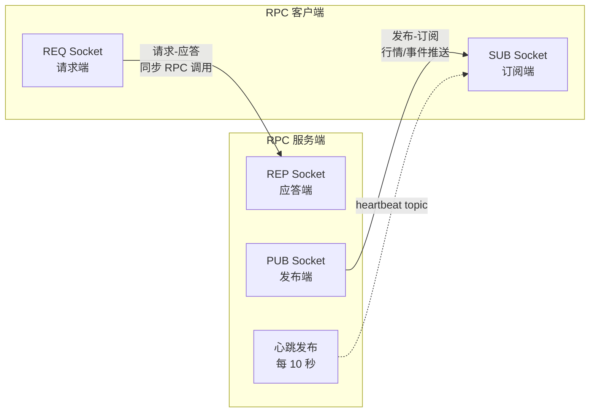
```mermaid
graph LR
    subgraph Server ["RPC 服务端"]
        REP["REP Socket<br/>应答端"]
        PUB["PUB Socket<br/>发布端"]
        HB["心跳发布<br/>每 10 秒"]
    end

    subgraph Client ["RPC 客户端"]
        REQ["REQ Socket<br/>请求端"]
        SUB["SUB Socket<br/>订阅端"]
    end

    REQ -->|"请求-应答<br/>同步 RPC 调用"| REP
    PUB -->|"发布-订阅<br/>行情/事件推送"| SUB
    HB -.->|"heartbeat topic"| SUB
```

**两个通道各自的职责**:

| 通道 | 模式 | 用途 | Android 类比 |
|---|---|---|---|
| REQ/REP | 请求-应答 | 同步调用（下单、查询等） | AIDL 同步方法调用 |
| PUB/SUB | 发布-订阅 | 异步推送（行情、委托回报） | ContentObserver / BroadcastReceiver |

### 5.3 序列化方式

使用 Python 的 `pickle` 序列化（通过 ZMQ 的 `send_pyobj` / `recv_pyobj`），相当于 Java 的 `Serializable`，但更灵活（可以序列化几乎所有 Python 对象）。

### 5.4 RpcClient 的动态代理

`RpcClient` 使用 Python 的 `__getattr__` 魔法方法实现**动态代理**，类似 Java 的 `Proxy.newProxyInstance`：

```python
class RpcClient:
    @lru_cache(100)
    def __getattr__(self, name: str):
        def dorpc(*args, **kwargs):
            timeout = kwargs.pop("timeout", 30000)
            req = [name, args, kwargs]            # 序列化方法名 + 参数
            with self._lock:
                self._socket_req.send_pyobj(req)  # 发送请求
                n = self._socket_req.poll(timeout) # 等待响应
                if not n:
                    raise RemoteException(f"Timeout")
                rep = self._socket_req.recv_pyobj() # 接收结果
            if rep[0]:
                return rep[1]                      # 返回结果
            else:
                raise RemoteException(rep[1])       # 抛出远程异常
        return dorpc
```

**这意味着**: 你可以像调用本地方法一样调用远程方法：

```python
client.send_order(order_req, "CTP")  # 实际上通过网络发送到服务端执行
client.get_all_positions()            # 远程查询持仓
```

### 5.5 RPC 调用完整时序图

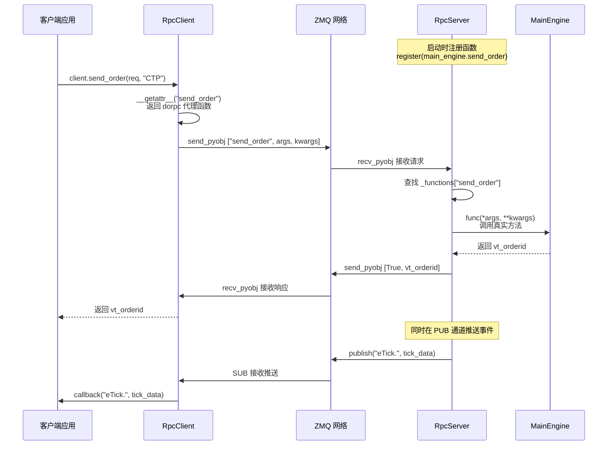
```mermaid
sequenceDiagram
    participant App as 客户端应用
    participant RC as RpcClient
    participant Net as ZMQ 网络
    participant RS as RpcServer
    participant ME as MainEngine

    Note over RS: 启动时注册函数<br/>register(main_engine.send_order)

    App->>RC: client.send_order(req, "CTP")
    RC->>RC: __getattr__("send_order")<br/>返回 dorpc 代理函数
    RC->>Net: send_pyobj ["send_order", args, kwargs]
    Net->>RS: recv_pyobj 接收请求
    RS->>RS: 查找 _functions["send_order"]
    RS->>ME: func(*args, **kwargs)<br/>调用真实方法
    ME-->>RS: 返回 vt_orderid
    RS->>Net: send_pyobj [True, vt_orderid]
    Net->>RC: recv_pyobj 接收响应
    RC-->>App: 返回 vt_orderid

    Note over RS: 同时在 PUB 通道推送事件
    RS->>Net: publish("eTick.", tick_data)
    Net->>RC: SUB 接收推送
    RC->>App: callback("eTick.", tick_data)
```

### 5.6 心跳机制

服务端每 10 秒通过 PUB 通道发送心跳；客户端如果超过 30 秒没有收到任何消息（包括心跳），触发 `on_disconnected()` 回调。

---

## Part 6: Chart 模块 -- K 线图表

### 6.1 这是什么

`vnpy.chart` 是一个基于 pyqtgraph 的**高性能 K 线图表组件**，支持大数据量显示和实时更新。类比 Android 中的 MPAndroidChart 库，但针对金融交易做了特殊优化。

### 6.2 组件结构

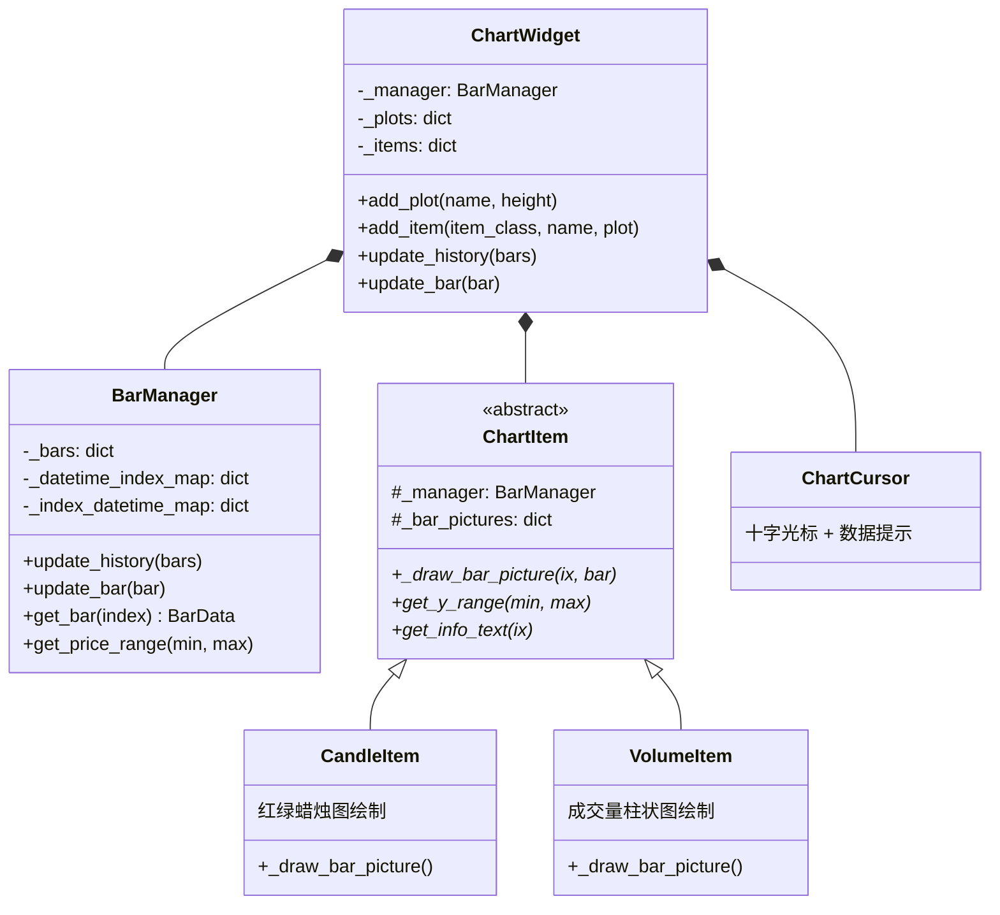
```mermaid
classDiagram
    class ChartWidget {
        -_manager: BarManager
        -_plots: dict
        -_items: dict
        +add_plot(name, height)
        +add_item(item_class, name, plot)
        +update_history(bars)
        +update_bar(bar)
    }

    class BarManager {
        -_bars: dict
        -_datetime_index_map: dict
        -_index_datetime_map: dict
        +update_history(bars)
        +update_bar(bar)
        +get_bar(index) BarData
        +get_price_range(min, max)
    }

    class ChartItem {
        <<abstract>>
        #_manager: BarManager
        #_bar_pictures: dict
        +_draw_bar_picture(ix, bar)*
        +get_y_range(min, max)*
        +get_info_text(ix)*
    }

    class CandleItem {
        +_draw_bar_picture()
        红绿蜡烛图绘制
    }

    class VolumeItem {
        +_draw_bar_picture()
        成交量柱状图绘制
    }

    class ChartCursor {
        十字光标 + 数据提示
    }

    ChartWidget *-- BarManager
    ChartWidget *-- ChartItem
    ChartWidget *-- ChartCursor
    ChartItem <|-- CandleItem
    ChartItem <|-- VolumeItem
```

### 6.3 工作流程

1. **数据管理**: `BarManager` 维护 K 线数据，建立 `datetime <-> index` 的双向映射
2. **图形缓存**: 每根 K 线对应一个 `QPicture` 缓存对象，避免重复绘制
3. **按需渲染**: `paint()` 时只绘制可见区域的 K 线（基于 `exposedRect` 计算范围）
4. **实时更新**: 新 K 线到来时，只需创建/更新一个 `QPicture`，无需全量重绘

### 6.4 典型使用

```python
chart = ChartWidget()
chart.add_plot("candle", minimum_height=200)   # 添加蜡烛图区域
chart.add_plot("volume", minimum_height=80)     # 添加成交量区域
chart.add_item(CandleItem, "candle", "candle")  # 蜡烛图
chart.add_item(VolumeItem, "volume", "volume")  # 成交量
chart.add_cursor()                               # 十字光标
chart.update_history(bar_list)                   # 加载历史数据
```

---

## Part 7: Alpha 模块 -- AI 量化研究

### 7.1 这是什么

`vnpy.alpha` 是 VeighNa 4.0 新增的**AI 量化策略研究模块**，提供从数据处理、特征工程、模型训练到策略回测的完整流水线。

用 Android 开发的视角来类比：如果传统交易是"写好 UI 逻辑让用户手动交易"，那 Alpha 模块就是"用机器学习自动发现交易规律并执行"。

### 7.2 Alpha 模块架构图

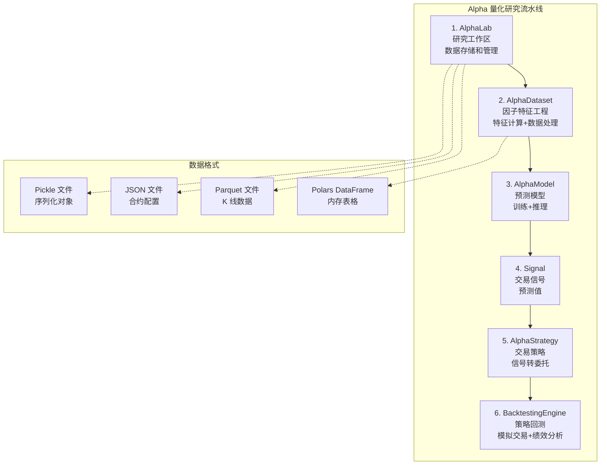
```mermaid
graph TB
    subgraph Pipeline ["Alpha 量化研究流水线"]
        direction TB
        A["1. AlphaLab<br/>研究工作区<br/>数据存储和管理"] --> B["2. AlphaDataset<br/>因子特征工程<br/>特征计算+数据处理"]
        B --> C["3. AlphaModel<br/>预测模型<br/>训练+推理"]
        C --> D["4. Signal<br/>交易信号<br/>预测值"]
        D --> E["5. AlphaStrategy<br/>交易策略<br/>信号转委托"]
        E --> F["6. BacktestingEngine<br/>策略回测<br/>模拟交易+绩效分析"]
    end

    subgraph DataFormats ["数据格式"]
        P1["Parquet 文件<br/>K 线数据"]
        P2["Polars DataFrame<br/>内存表格"]
        P3["Pickle 文件<br/>序列化对象"]
        P4["JSON 文件<br/>合约配置"]
    end

    A -.-> P1
    A -.-> P4
    B -.-> P2
    A -.-> P3
```

### 7.3 AlphaLab -- 研究工作区

#### 7.3.1 这是什么

`AlphaLab` 管理一个**文件系统工作区**，存放量化研究所需的所有数据。类比 Android 开发中的 Room 数据库 + 文件存储的组合。

#### 7.3.2 目录布局

```
lab_folder/                    # 研究工作区根目录
├── daily/                     # 日线 K 线数据
│   ├── 000001.SSE.parquet     # 每个股票一个 Parquet 文件
│   ├── 000002.SZE.parquet
│   └── ...
├── minute/                    # 分钟线 K 线数据
│   └── ...
├── component/                 # 指数成分股数据
│   └── 000300.SSE.db          # shelve 格式，记录每天的成分股列表
├── dataset/                   # 保存的 AlphaDataset 对象
│   └── my_dataset.pkl         # pickle 序列化
├── model/                     # 保存的 AlphaModel 对象
│   └── my_model.pkl
├── signal/                    # 生成的交易信号
│   └── my_signal.parquet
└── contract.json              # 合约配置 (手续费率、合约乘数等)
```

#### 7.3.3 核心 API

```python
lab = AlphaLab("/path/to/lab")

# 数据存取 (类比 Room DAO)
lab.save_bar_data(bars: list[BarData])              # 保存 K 线到 Parquet
df = lab.load_bar_df(vt_symbols, interval, start, end)  # 加载并预处理

# 指数成分
lab.save_component_data(vt_symbol, date, components)
symbols = lab.load_component_symbols(vt_symbol, date)

# 合约配置
lab.add_contract_setting(vt_symbol, long_rate, short_rate, size, pricetick)

# 模型/数据集 存取 (pickle 序列化)
lab.save_dataset(name, dataset)
dataset = lab.load_dataset(name)
lab.save_model(name, model)
model = lab.load_model(name)

# 信号存取 (Polars DataFrame -> Parquet)
lab.save_signal(name, signal_df)
signal_df = lab.load_signal(name)
```

#### 7.3.4 load_bar_df 的数据预处理

`load_bar_df()` 不只是简单读取数据，它还做了以下处理：

1. **扩展时间窗口**: 前后多读一些数据，确保时序特征（如 MA20）在起始日就有足够历史
2. **计算 VWAP**: 添加 `vwap = turnover / volume`（成交额加权平均价）
3. **价格归一化**: 所有 OHLC 价格除以第一天的收盘价（消除股价绝对值的影响）
4. **处理停牌**: 全零行标记为 NaN

### 7.4 AlphaDataset -- 因子特征工程

#### 7.4.1 这是什么

`AlphaDataset` 负责将原始行情数据转换为**可供机器学习模型训练的特征矩阵**。类比 Android 中把原始 JSON 数据转换为 RecyclerView 可用的 List<Item>，但复杂得多。

#### 7.4.2 核心概念

**"因子"（Factor/Feature）**: 从行情数据中提取的量化指标。比如：
- "过去 20 天收益率" -> `ts_delay(close, -20) / close - 1`
- "当日收盘价在过去 10 天中的排名" -> `ts_rank(close, 10)`
- "成交量的 5 日移动平均" -> `ts_mean(volume, 5)`

**"标签"（Label）**: 模型要预测的目标值。比如 "未来 3 天的收益率"。

#### 7.4.3 表达式 DSL

VeighNa 内置了一套字符串表达式引擎，支持用简洁的表达式定义复杂因子：

| 函数族 | 前缀 | 示例 | 说明 |
|---|---|---|---|
| 时序函数 | `ts_` | `ts_delay(close, 5)` | 5 天前的收盘价 |
| | | `ts_mean(volume, 20)` | 20 日均量 |
| | | `ts_corr(close, volume, 10)` | 10 日价量相关性 |
| | | `ts_rank(close, 10)` | 10 日窗口内排名 |
| 截面函数 | `cs_` | `cs_rank(close)` | 当日所有股票中的排名 |
| | | `cs_mean(volume)` | 当日所有股票均量 |
| 技术分析 | `ta_` | `ta_rsi(close, 14)` | 14 日 RSI 指标 |
| 数学函数 | `math_` | `math_log(volume)` | 取对数 |

#### 7.4.4 数据处理管道

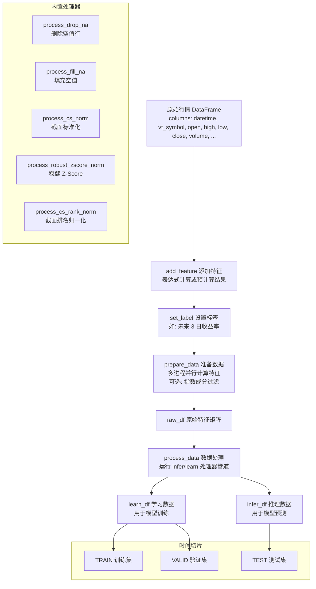
```mermaid
graph TB
    A["原始行情 DataFrame<br/>columns: datetime, vt_symbol, open, high, low, close, volume, ..."] --> B["add_feature 添加特征<br/>表达式计算或预计算结果"]
    B --> C["set_label 设置标签<br/>如: 未来 3 日收益率"]
    C --> D["prepare_data 准备数据<br/>多进程并行计算特征<br/>可选: 指数成分过滤"]
    D --> E["raw_df 原始特征矩阵"]
    E --> F["process_data 数据处理<br/>运行 infer/learn 处理器管道"]

    subgraph Processors ["内置处理器"]
        P1["process_drop_na<br/>删除空值行"]
        P2["process_fill_na<br/>填充空值"]
        P3["process_cs_norm<br/>截面标准化"]
        P4["process_robust_zscore_norm<br/>稳健 Z-Score"]
        P5["process_cs_rank_norm<br/>截面排名归一化"]
    end

    F --> G["infer_df 推理数据<br/>用于模型预测"]
    F --> H["learn_df 学习数据<br/>用于模型训练"]

    subgraph Segments ["时间切片"]
        S1["TRAIN 训练集"]
        S2["VALID 验证集"]
        S3["TEST 测试集"]
    end

    H --> S1
    H --> S2
    G --> S3
```

#### 7.4.5 infer_df vs learn_df

这是理解 Alpha 模块的关键区别：

| 属性 | infer_df (推理数据) | learn_df (学习数据) |
|---|---|---|
| 用途 | 模型预测时使用 | 模型训练时使用 |
| 处理器 | 只经过 infer 处理器 | 经过 infer + learn 处理器 |
| 典型处理 | 填充空值、基础归一化 | 更严格的清洗、标准化 |
| 类比 | 生产环境的输入数据 | 训练环境的数据 |

#### 7.4.6 预置因子集

**Alpha 158** (源自微软 Qlib): 158 个因子，覆盖 K 线形态、价格趋势、时序波动等多维度，并自动设置标签为 "未来 3 天收益率"：

```python
# Alpha158 的标签设置
self.set_label("ts_delay(close, -3) / ts_delay(close, -1) - 1")
# 含义: 3天后的收盘价 / 1天后的收盘价 - 1 = 未来 2 天的收益率
```

**Alpha 101** (源自 WorldQuant): 101 个经典的量化因子。

### 7.5 AlphaModel -- 预测模型

#### 7.5.1 这是什么

`AlphaModel` 是预测模型的抽象基类，定义了统一的训练和预测接口。类似 Android 中定义一个 `interface ModelProvider { fun train(); fun predict() }`。

#### 7.5.2 统一接口

```python
class AlphaModel(ABC):
    @abstractmethod
    def fit(self, dataset: AlphaDataset) -> None:
        """训练模型 (使用 TRAIN + VALID 数据)"""
        pass

    @abstractmethod
    def predict(self, dataset: AlphaDataset, segment: Segment) -> np.ndarray:
        """预测 (返回预测值数组)"""
        pass

    def detail(self) -> None:
        """模型解释 (可选, 如特征重要性)"""
        pass
```

#### 7.5.3 三种内置模型

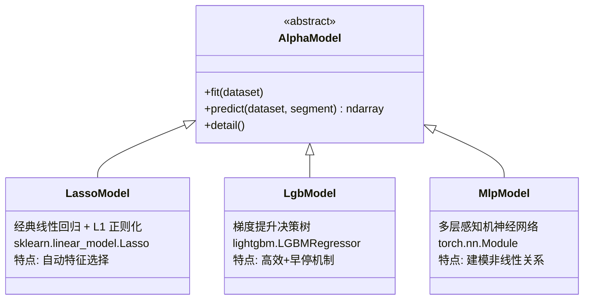
```mermaid
classDiagram
    class AlphaModel {
        <<abstract>>
        +fit(dataset)
        +predict(dataset, segment) ndarray
        +detail()
    }

    class LassoModel {
        经典线性回归 + L1 正则化
        sklearn.linear_model.Lasso
        特点: 自动特征选择
    }

    class LgbModel {
        梯度提升决策树
        lightgbm.LGBMRegressor
        特点: 高效+早停机制
    }

    class MlpModel {
        多层感知机神经网络
        torch.nn.Module
        特点: 建模非线性关系
    }

    AlphaModel <|-- LassoModel
    AlphaModel <|-- LgbModel
    AlphaModel <|-- MlpModel
```

**数据流**: 模型从 `AlphaDataset` 的 `learn_df` 中取 `TRAIN`/`VALID` 切片进行训练；使用 `infer_df` 进行预测。特征列是 DataFrame 的第 3 列到倒数第 2 列（排除 `datetime`、`vt_symbol` 和最后的 `label` 列）。

### 7.6 AlphaStrategy + BacktestingEngine -- 策略回测

#### 7.6.1 AlphaStrategy -- 策略模板

`AlphaStrategy` 定义了一个**信号驱动的多股票组合策略**模板：

```python
class AlphaStrategy:
    def on_init(self):
        """策略初始化 (加载信号、设定参数)"""
        pass

    def on_bars(self, bars: dict[str, BarData]):
        """收到新 K 线时回调 (核心逻辑)"""
        pass

    def on_trade(self, trade: TradeData):
        """成交回报"""
        pass

    def execute_trading(self, bars, price_add):
        """执行交易: 将 target_data 与 pos_data 的差异转化为委托"""
        pass
```

**核心机制**: 策略维护两个字典:
- `pos_data`: 当前实际持仓（每只股票持有多少股）
- `target_data`: 目标持仓（基于信号计算出应该持有多少股）

`execute_trading()` 方法计算差异并发送委托，逐步调整到目标持仓。

#### 7.6.2 BacktestingEngine -- 回测引擎

回测引擎模拟真实交易环境，逐日推进数据并撮合委托：

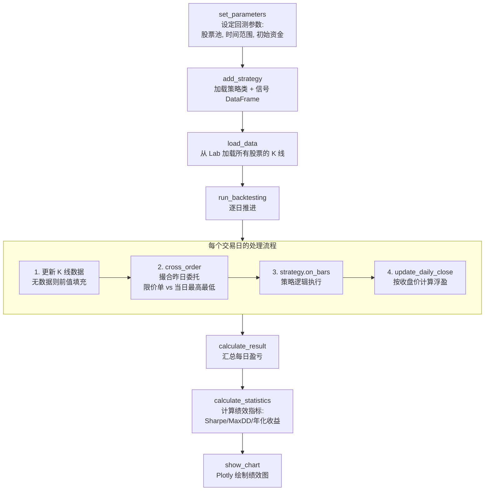
```mermaid
graph TB
    A["set_parameters<br/>设定回测参数:<br/>股票池, 时间范围, 初始资金"] --> B["add_strategy<br/>加载策略类 + 信号 DataFrame"]
    B --> C["load_data<br/>从 Lab 加载所有股票的 K 线"]
    C --> D["run_backtesting<br/>逐日推进"]

    subgraph DailyLoop ["每个交易日的处理流程"]
        D1["1. 更新 K 线数据<br/>无数据则前值填充"] --> D2["2. cross_order<br/>撮合昨日委托<br/>限价单 vs 当日最高最低"]
        D2 --> D3["3. strategy.on_bars<br/>策略逻辑执行"]
        D3 --> D4["4. update_daily_close<br/>按收盘价计算浮盈"]
    end

    D --> DailyLoop
    DailyLoop --> E["calculate_result<br/>汇总每日盈亏"]
    E --> F["calculate_statistics<br/>计算绩效指标:<br/>Sharpe/MaxDD/年化收益"]
    F --> G["show_chart<br/>Plotly 绘制绩效图"]
```

#### 7.6.3 回测日内时序图

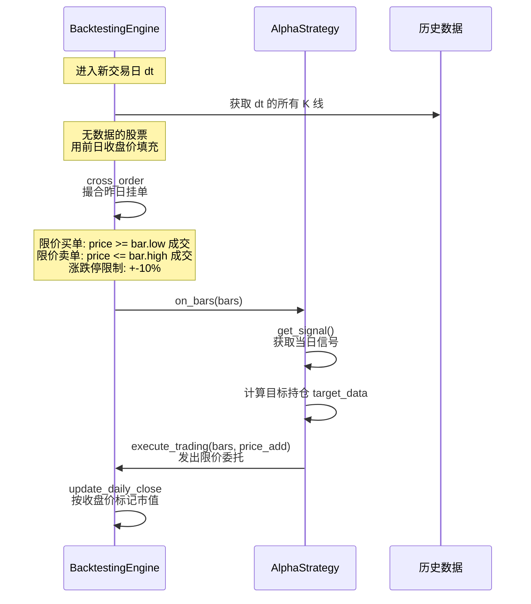
```mermaid
sequenceDiagram
    participant Engine as BacktestingEngine
    participant Strategy as AlphaStrategy
    participant Market as 历史数据

    Note over Engine: 进入新交易日 dt

    Engine->>Market: 获取 dt 的所有 K 线
    Note over Engine: 无数据的股票<br/>用前日收盘价填充

    Engine->>Engine: cross_order<br/>撮合昨日挂单
    Note over Engine: 限价买单: price >= bar.low 成交<br/>限价卖单: price <= bar.high 成交<br/>涨跌停限制: +-10%

    Engine->>Strategy: on_bars(bars)
    Strategy->>Strategy: get_signal()<br/>获取当日信号
    Strategy->>Strategy: 计算目标持仓 target_data
    Strategy->>Engine: execute_trading(bars, price_add)<br/>发出限价委托

    Engine->>Engine: update_daily_close<br/>按收盘价标记市值
```

### 7.7 端到端流程图 -- 从数据到收益

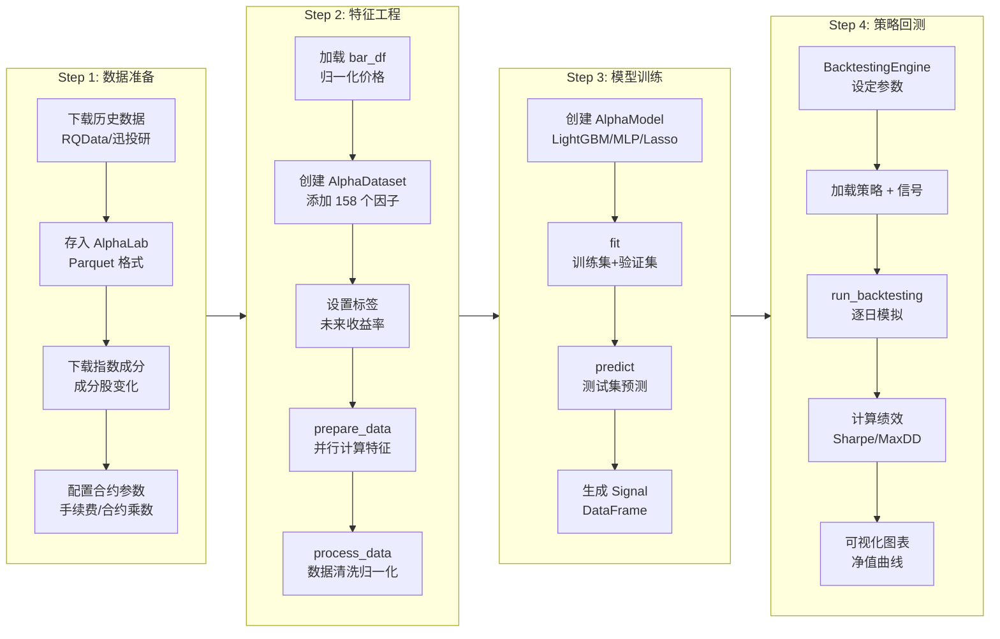
```mermaid
graph LR
    subgraph step1 ["Step 1: 数据准备"]
        DL["下载历史数据<br/>RQData/迅投研"]
        DL --> LAB["存入 AlphaLab<br/>Parquet 格式"]
        LAB --> COMP["下载指数成分<br/>成分股变化"]
        COMP --> CONTRACT["配置合约参数<br/>手续费/合约乘数"]
    end

    subgraph step2 ["Step 2: 特征工程"]
        DF["加载 bar_df<br/>归一化价格"]
        DF --> DS["创建 AlphaDataset<br/>添加 158 个因子"]
        DS --> LABEL["设置标签<br/>未来收益率"]
        LABEL --> PREP["prepare_data<br/>并行计算特征"]
        PREP --> PROC["process_data<br/>数据清洗归一化"]
    end

    subgraph step3 ["Step 3: 模型训练"]
        MODEL["创建 AlphaModel<br/>LightGBM/MLP/Lasso"]
        MODEL --> FIT["fit<br/>训练集+验证集"]
        FIT --> PRED["predict<br/>测试集预测"]
        PRED --> SIG["生成 Signal<br/>DataFrame"]
    end

    subgraph step4 ["Step 4: 策略回测"]
        BT["BacktestingEngine<br/>设定参数"]
        BT --> STRAT["加载策略 + 信号"]
        STRAT --> RUN["run_backtesting<br/>逐日模拟"]
        RUN --> STAT["计算绩效<br/>Sharpe/MaxDD"]
        STAT --> CHART["可视化图表<br/>净值曲线"]
    end

    step1 --> step2
    step2 --> step3
    step3 --> step4
```

---

## Part 8: 业务全景 -- 从量化交易员视角理解系统

### 8.1 什么是量化交易

用一句话解释：**量化交易 = 用程序代替人做投资决策**。

传统交易员盯着行情手动买卖，量化交易员编写策略程序，让计算机自动分析行情并执行交易。VeighNa 就是这样一个帮助量化交易员的平台。

### 8.2 实盘交易流程

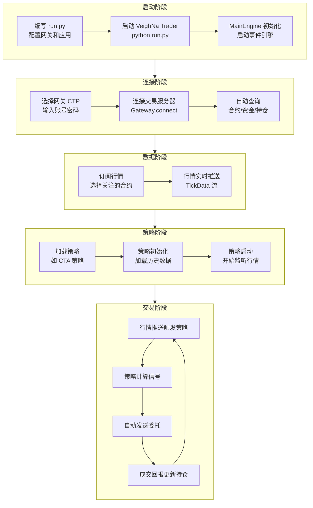
```mermaid
graph TB
    subgraph Setup ["启动阶段"]
        S1["编写 run.py<br/>配置网关和应用"] --> S2["启动 VeighNa Trader<br/>python run.py"]
        S2 --> S3["MainEngine 初始化<br/>启动事件引擎"]
    end

    subgraph Connect ["连接阶段"]
        C1["选择网关 CTP<br/>输入账号密码"] --> C2["连接交易服务器<br/>Gateway.connect"]
        C2 --> C3["自动查询<br/>合约/资金/持仓"]
    end

    subgraph Subscribe ["数据阶段"]
        D1["订阅行情<br/>选择关注的合约"] --> D2["行情实时推送<br/>TickData 流"]
    end

    subgraph Strategy ["策略阶段"]
        T1["加载策略<br/>如 CTA 策略"] --> T2["策略初始化<br/>加载历史数据"]
        T2 --> T3["策略启动<br/>开始监听行情"]
    end

    subgraph Trading ["交易阶段"]
        direction TB
        TR1["行情推送触发策略"] --> TR2["策略计算信号"]
        TR2 --> TR3["自动发送委托"]
        TR3 --> TR4["成交回报更新持仓"]
        TR4 --> TR1
    end

    Setup --> Connect
    Connect --> Subscribe
    Subscribe --> Strategy
    Strategy --> Trading
```

对应的启动代码：

```python
from vnpy.event import EventEngine
from vnpy.trader.engine import MainEngine
from vnpy.trader.ui import MainWindow, create_qapp
from vnpy_ctp import CtpGateway
from vnpy_ctastrategy import CtaStrategyApp

def main():
    qapp = create_qapp()                          # 创建 Qt 应用
    event_engine = EventEngine()                    # 创建事件引擎
    main_engine = MainEngine(event_engine)          # 创建主引擎

    main_engine.add_gateway(CtpGateway)            # 注册 CTP 网关
    main_engine.add_app(CtaStrategyApp)            # 注册 CTA 策略应用

    main_window = MainWindow(main_engine, event_engine)  # 创建主窗口
    main_window.showMaximized()                     # 全屏显示
    qapp.exec()                                     # 进入事件循环

if __name__ == "__main__":
    main()
```

### 8.3 策略研究流程 (Alpha)

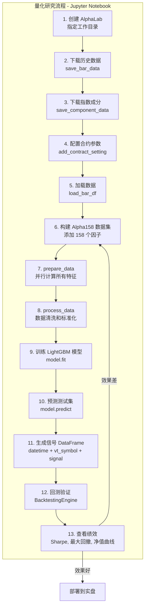
```mermaid
graph TB
    subgraph Research ["量化研究流程 - Jupyter Notebook"]
        R1["1. 创建 AlphaLab<br/>指定工作目录"] --> R2["2. 下载历史数据<br/>save_bar_data"]
        R2 --> R3["3. 下载指数成分<br/>save_component_data"]
        R3 --> R4["4. 配置合约参数<br/>add_contract_setting"]
        R4 --> R5["5. 加载数据<br/>load_bar_df"]
        R5 --> R6["6. 构建 Alpha158 数据集<br/>添加 158 个因子"]
        R6 --> R7["7. prepare_data<br/>并行计算所有特征"]
        R7 --> R8["8. process_data<br/>数据清洗和标准化"]
        R8 --> R9["9. 训练 LightGBM 模型<br/>model.fit"]
        R9 --> R10["10. 预测测试集<br/>model.predict"]
        R10 --> R11["11. 生成信号 DataFrame<br/>datetime + vt_symbol + signal"]
        R11 --> R12["12. 回测验证<br/>BacktestingEngine"]
        R12 --> R13["13. 查看绩效<br/>Sharpe, 最大回撤, 净值曲线"]
    end

    R13 -->|"效果好"| Deploy["部署到实盘"]
    R13 -->|"效果差"| R6
```

### 8.4 分布式部署 (RPC)

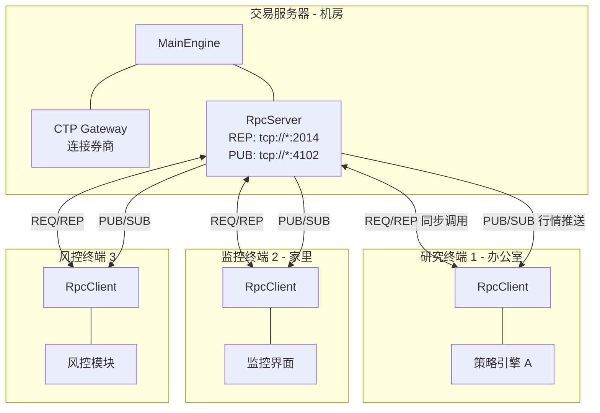
```mermaid
graph TB
    subgraph Server ["交易服务器 - 机房"]
        ME["MainEngine"]
        GW["CTP Gateway<br/>连接券商"]
        RPC_S["RpcServer<br/>REP: tcp://*:2014<br/>PUB: tcp://*:4102"]
        ME --- GW
        ME --- RPC_S
    end

    subgraph Client1 ["研究终端 1 - 办公室"]
        RC1["RpcClient"]
        STRAT1["策略引擎 A"]
        RC1 --- STRAT1
    end

    subgraph Client2 ["监控终端 2 - 家里"]
        RC2["RpcClient"]
        UI2["监控界面"]
        RC2 --- UI2
    end

    subgraph Client3 ["风控终端 3"]
        RC3["RpcClient"]
        RISK["风控模块"]
        RC3 --- RISK
    end

    RPC_S <-->|"REQ/REP 同步调用"| RC1
    RPC_S -->|"PUB/SUB 行情推送"| RC1
    RPC_S <-->|"REQ/REP"| RC2
    RPC_S -->|"PUB/SUB"| RC2
    RPC_S <-->|"REQ/REP"| RC3
    RPC_S -->|"PUB/SUB"| RC3
```

**使用场景**:
- 交易服务器放在离交易所近的机房（低延迟）
- 多个客户端远程连接，分别负责策略运行、行情监控、风控管理
- 所有客户端共享同一个交易通道，避免重复登录

### 8.5 数据库和数据源

VeighNa 的数据库和数据源都是**可插拔**的，通过配置文件切换：

```json
// vt_setting.json
{
    "database.name": "sqlite",    // 或 "mysql", "mongodb", "postgresql"
    "datafeed.name": "rqdata"     // 或 "xt", "tushare", "wind"
}
```

系统在运行时通过**工厂模式**动态加载对应实现:

```python
# database.py 中的工厂方法
def get_database() -> BaseDatabase:
    database_name = SETTINGS["database.name"]     # 读取配置
    module = importlib.import_module(f"vnpy_{database_name}")  # 动态导入
    return module.Database()                       # 返回实例
```

这与 Android 的 `ServiceLoader` (SPI) 机制类似。

---

## Part 9: 设计模式速查

### Python vs Java/Android 设计模式对照表

| 设计模式 | VeighNa 中的应用 | Java/Android 等价物 |
|---|---|---|
| **Observer / 观察者** | `EventEngine` + `register/unregister` | `EventBus` / `LiveData.observe` / `BroadcastReceiver` |
| **Facade / 门面** | `MainEngine` 统一 API | `Application` 单例 / `Repository` 层 |
| **Adapter / 适配器** | `BaseGateway` 适配不同交易 API | `Retrofit` 接口 / `RecyclerView.Adapter` |
| **Template Method / 模板方法** | `BaseGateway` 的 `on_*` 回调 + 抽象方法 | `BaseActivity` 的 `onCreate` 等生命周期 |
| **Factory / 工厂** | `get_database()` / `get_datafeed()` 动态加载 | `ServiceLoader` / `SPI` |
| **Plugin / 插件** | `BaseApp` 声明式注册 + 动态 UI 加载 | Android `ContentProvider` 自动注册 |
| **Strategy / 策略** | `AlphaModel` 不同实现可互换 | `Comparator` / 策略接口 |
| **Proxy / 代理** | `RpcClient.__getattr__` 动态代理 | `java.lang.reflect.Proxy` / Retrofit 动态代理 |
| **Repository / 仓库** | `BaseDatabase` CRUD 抽象 | `Room DAO` |
| **Dataclass / 值对象** | `@dataclass` 的 `TickData`, `OrderData` 等 | Kotlin `data class` |
| **Registry / 注册表** | `MainEngine.gateways/engines/apps` | `ServiceManager` / `ComponentName` 注册 |
| **Pipeline / 管道** | Alpha Dataset 的处理器链 | OkHttp Interceptor Chain |

### Python 语法速查（对比 Java/Kotlin）

| Python | Java/Kotlin | 说明 |
|---|---|---|
| `@dataclass` | `data class` (Kotlin) | 自动生成 `__init__`, `__repr__`, `__eq__` |
| `class Foo(ABC)` + `@abstractmethod` | `abstract class` / `interface` | 抽象基类 |
| `dict[str, int]` | `Map<String, Integer>` / `HashMap` | 字典/映射 |
| `list[str]` | `List<String>` / `ArrayList` | 列表 |
| `def foo(self, x: int) -> str:` | `fun foo(x: Int): String` | 方法定义 + 类型注解 |
| `from x import Y` | `import x.Y` | 导入 |
| `if __name__ == "__main__":` | `fun main()` | 入口点 |
| `__init__(self, ...)` | 构造函数 | 类初始化方法 |
| `__post_init__` | init {} (Kotlin) | dataclass 初始化后的钩子 |
| `__getattr__` | `Proxy.invoke()` | 属性访问拦截 (元编程) |
| `with lock:` | `synchronized(lock) {}` | 同步块 |
| `Thread(target=func)` | `Thread(Runnable)` | 创建线程 |
| `Queue()` | `BlockingQueue` | 线程安全队列 |
| `defaultdict(list)` | 自己实现的 Map + getOrDefault | 带默认值的字典 |

---

## Part 10: 术语表

### 量化交易术语

| 术语 | 英文 | 含义 |
|---|---|---|
| 行情 | Market Data / Tick | 市场实时价格数据 |
| 委托/报单 | Order | 向交易所发送的买卖请求 |
| 成交 | Trade / Fill | 委托被执行的结果 |
| 持仓 | Position | 当前持有的证券/期货数量 |
| 合约 | Contract / Instrument | 可交易的金融产品 |
| K 线 | Bar / Candlestick | 一段时间内的开高低收价格汇总 |
| Tick | Tick | 逐笔行情数据，最细粒度的价格信息 |
| 多头/做多 | Long | 买入，期望价格上涨获利 |
| 空头/做空 | Short | 卖出（期货可先卖后买），期望价格下跌获利 |
| 平仓 | Close / Offset | 结束持仓（买入后卖出或卖出后买入） |
| 平今 | Close Today | 平掉今天开的仓（手续费可能不同） |
| 平昨 | Close Yesterday | 平掉昨天之前开的仓 |
| 滑点 | Slippage | 预期成交价与实际成交价的差异 |
| 回测 | Backtesting | 用历史数据模拟策略交易，验证效果 |
| 夏普比率 | Sharpe Ratio | 风险调整后的收益指标，越高越好 |
| 最大回撤 | Max Drawdown | 净值从高点到低点的最大跌幅 |
| CTA | Commodity Trading Advisor | 管理期货策略，趋势跟踪为主 |
| 因子 | Factor / Alpha | 预测股票收益的量化指标 |
| 截面 | Cross-Section | 同一时间点，横跨所有股票的数据 |
| 时序 | Time-Series | 同一股票，跨时间的数据 |

### Python / 技术术语

| 术语 | 含义 | Android 对应 |
|---|---|---|
| `pip` | Python 包管理器 | Gradle dependencies |
| `wheel` | Python 的预编译包格式 | AAR 包 |
| `PyPI` | Python 包索引 (仓库) | Maven Central |
| `dataclass` | 数据类装饰器 | Kotlin data class |
| `ABC` | Abstract Base Class 抽象基类 | abstract class |
| `pickle` | Python 对象序列化 | Java Serializable |
| `Parquet` | 列式存储文件格式 | 类似 SQLite，但面向列 |
| `Polars` | 高性能 DataFrame 库 | 无直接对应，数据表格处理 |
| `pandas` | 数据分析库 | 类似 Excel 编程 |
| `numpy` | 数值计算库 | 高性能数组运算 |
| `PySide6 / Qt` | 跨平台 GUI 框架 | Android View 系统 |
| `ZeroMQ / zmq` | 高性能消息队列 | AIDL / gRPC |
| `loguru` | 结构化日志库 | Timber |
| `Jupyter Notebook` | 交互式代码笔记本 | 无直接对应，类似 REPL + 文档 |
| `shelve` | 基于文件的键值存储 | SharedPreferences |
| `Hatchling` | Python 构建后端 | AGP (Android Gradle Plugin) |

---

## 附录: 快速参考

### 如何运行项目

```bash
# 1. 安装 (macOS)
bash install_osx.sh

# 2. 安装 alpha 模块依赖
pip install ".[alpha]"

# 3. 运行 GUI
cd examples/veighna_trader
python run.py

# 4. 运行 alpha 研究
jupyter notebook examples/alpha_research/
```

### 核心代码入口

| 场景 | 入口文件 | 说明 |
|---|---|---|
| GUI 交易 | `examples/veighna_trader/run.py` | 启动完整交易界面 |
| 无界面交易 | `examples/no_ui/run.py` | 后台运行策略 |
| Alpha 研究 | `examples/alpha_research/*.ipynb` | Jupyter Notebook |
| CTA 回测 | `examples/cta_backtesting/*.ipynb` | CTA 策略回测 |

### 关键文件速查

| 你想了解 | 去看这个文件 |
|---|---|
| 系统如何启动 | `vnpy/trader/engine.py` -> `MainEngine.__init__` |
| 事件如何分发 | `vnpy/event/engine.py` -> `EventEngine._process` |
| 网关如何对接 | `vnpy/trader/gateway.py` -> `BaseGateway` |
| 数据模型定义 | `vnpy/trader/object.py` |
| 所有事件类型 | `vnpy/trader/event.py` |
| 全局配置项 | `vnpy/trader/setting.py` -> `SETTINGS` |
| UI 表格组件 | `vnpy/trader/ui/widget.py` -> `BaseMonitor` |
| RPC 远程调用 | `vnpy/rpc/client.py` -> `RpcClient.__getattr__` |
| Alpha 数据集 | `vnpy/alpha/dataset/template.py` -> `AlphaDataset` |
| Alpha 模型 | `vnpy/alpha/model/template.py` -> `AlphaModel` |
| Alpha 回测 | `vnpy/alpha/strategy/backtesting.py` -> `BacktestingEngine` |
