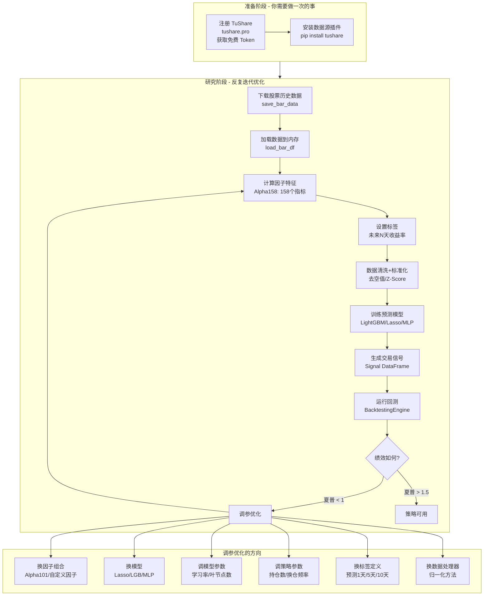
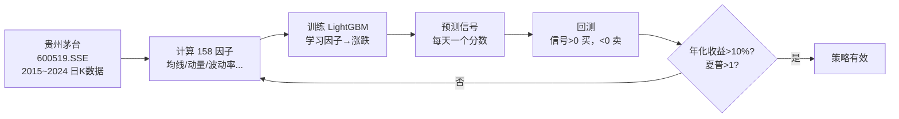
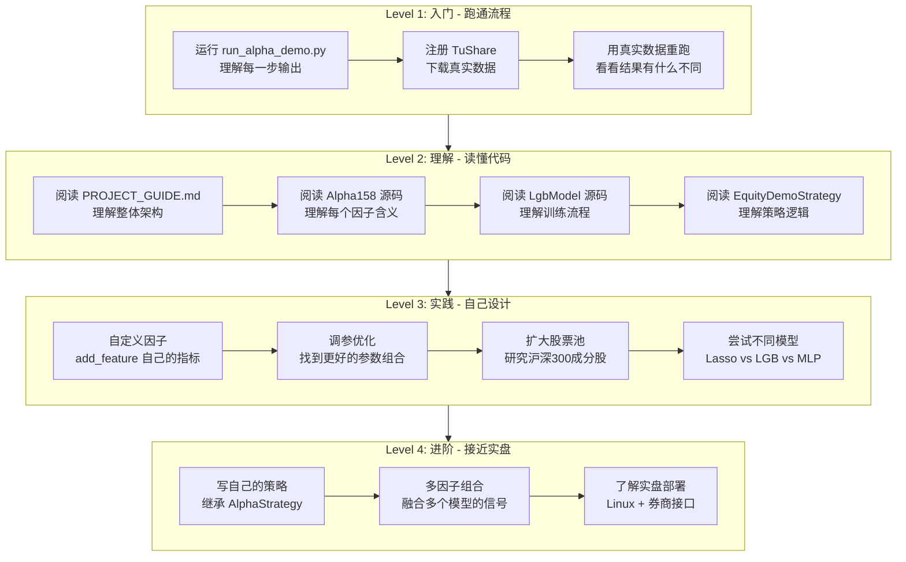

# VeighNa Alpha 量化研究入门指南

> **面向读者**: 零量化基础的程序员，想从"研究一只股票"开始学习。
> 本文档通俗解释每一个概念，逐行讲解代码，并提供完整的调参手册。

---

## 目录

- [一、核心概念通俗解释](#一核心概念通俗解释)
- [二、完整业务流程图](#二完整业务流程图)
- [三、run_alpha_demo.py 逐行讲解](#三run_alpha_demopy-逐行讲解)
- [四、调参优化手册](#四调参优化手册)
- [五、绩效指标详解](#五绩效指标详解)
- [六、用 TuShare 获取真实数据](#六用-tushare-获取真实数据)
- [七、学习路线图](#七学习路线图)

---

## 一、核心概念通俗解释

### 1.1 K 线 (Bar) -- 股票的"心电图"

一根 K 线记录了**一段时间内**（通常一天）的四个关键价格：

```
        最高价 (High)
         │
    ┌────┤              ┌────┐
    │    │  阳线(涨)     │    │  阴线(跌)
    │    │  收盘 > 开盘   │    │  收盘 < 开盘
    │  ──┤── 收盘价      │  ──┤── 开盘价
    │    │              │    │
    │  ──┤── 开盘价      │  ──┤── 收盘价
    │    │              │    │
    └────┤              └────┤
         │                   │
        最低价 (Low)         最低价
```

**代码中的 BarData**:

```python
bar = BarData(
    symbol="600519",          # 股票代码 (贵州茅台)
    exchange=Exchange.SSE,    # 交易所 (上海)
    datetime=...,             # 日期
    open_price=1800.00,       # 开盘价: 早上 9:30 的第一笔成交价
    high_price=1850.00,       # 最高价: 今天的最高成交价
    low_price=1780.00,        # 最低价: 今天的最低成交价
    close_price=1830.00,      # 收盘价: 下午 3:00 的最后一笔成交价
    volume=12345,             # 成交量: 今天总共成交了多少股
    turnover=22500000.0,      # 成交额: 今天总共成交了多少钱
)
```

**类比**: 如果股票是一个 Android App，K 线就是它的**日活/留存/收入**日报表。

### 1.2 因子 (Factor) -- 股票的"体检指标"

因子就是从历史 K 线数据中**提炼出的统计指标**，用来描述股票当前的"状态"。

| 因子类型 | 通俗解释 | 示例 | 类比 |
|---|---|---|---|
| **均线偏离** | 现在的价格比过去 N 天的平均价高还是低 | `ma_5 = 5日均价 / 今日收盘` | 用户最近 5 天的日均使用时长 vs 今天 |
| **动量** | 过去 N 天涨了多少 | `roc_10 = 10天前的价格 / 今天价格` | App 过去 10 天的 DAU 增长率 |
| **波动率** | 价格变化的剧烈程度 | `std_20 = 20日收益率标准差` | App 日活的稳定性 |
| **排名** | 在过去 N 天中，今天排第几 | `rank_30 = 30日窗口内的排名` | 在过去 30 天中今天的日活排第几 |
| **量价关系** | 价格和成交量的关联程度 | `corr_10 = 10日价量相关性` | DAU 和收入的相关性 |
| **RSV** | 今天价格在近期波动范围的位置 | `(收盘-最低)/(最高-最低)` | 今天日活在近期高低点中的位置 |

**Alpha158** 就是一次性计算 158 个这样的指标，构成一个"全面体检报告"。

### 1.3 标签 (Label) -- 我们想预测的"答案"

标签是**模型学习的目标**，也就是"正确答案"。在量化研究中，标签通常是**未来 N 天的收益率**：

```python
label = "未来 3 天收盘价 / 明天收盘价 - 1"
# 代码: ts_delay(close, -3) / ts_delay(close, -1) - 1
# 注意: ts_delay(close, -3) 表示"3天后的收盘价"，负号=看未来
```

**如果 label = 0.05**: 意味着买入后持有到第 3 天，能赚 5%
**如果 label = -0.03**: 意味着买入后持有到第 3 天，会亏 3%

**类比**: 就像预测一个 App 用户"未来 3 天会不会付费"，你用过去的行为数据（因子）来训练模型。

### 1.4 数据集划分 -- 训练集 / 验证集 / 测试集

```
时间线:
2015 ──────── 2019 ─── 2021 ─── 2023
│    训练集 TRAIN    │  验证 VALID │  测试 TEST │
│    模型在这里学习   │  调参用     │  最终评估   │
│                    │            │            │
│   "课本+习题"      │  "模拟考"   │  "高考"    │
```

- **训练集**: 喂给模型学习的数据（类比：训练样本）
- **验证集**: 调参时用来评估效果（类比：验证集防止过拟合）
- **测试集**: 最终评估模型好坏，模型从未见过（类比：线上 A/B 测试）

### 1.5 交易信号 (Signal) -- 模型的"预测结果"

信号是模型对每只股票每天的**预测值**，存为一个表格文件：

```
┌────────────┬──────────────┬──────────┐
│ datetime   │ vt_symbol    │ signal   │
├────────────┼──────────────┼──────────┤
│ 2022-01-04 │ 600519.SSE   │  0.0234  │  <-- 模型看好茅台，预测会涨
│ 2022-01-04 │ 000858.SZSE  │ -0.0156  │  <-- 模型看空五粮液
│ 2022-01-04 │ 601318.SSE   │  0.0089  │  <-- 模型略看好平安
│ 2022-01-05 │ 600519.SSE   │  0.0178  │  <-- 第二天的预测
│ ...        │ ...          │ ...      │
└────────────┴──────────────┴──────────┘
```

**信号的使用方式**: 策略把每天所有股票的 signal 排序，买入排名靠前的 N 只，卖出排名靠后的。

**类比**: 就像推荐系统给每个视频打分，然后按分数排序推给用户。信号分数越高 = 推荐权重越高 = 越应该买入。

### 1.6 回测 (Backtesting) -- "时光穿越"验证策略

回测 = 用**历史数据**模拟交易，看如果按照这个策略执行，过去几年能赚多少钱。

```
  模拟交易过程:

  2022-01-04  读取当天信号 → 排序 → 买入 Top 10 股票
  2022-01-05  结算昨天的委托 → 读取新信号 → 调仓
  2022-01-06  结算 → 读信号 → 调仓
  ...
  2023-06-30  最后一天 → 全部卖出 → 统计总盈亏
```

**为什么需要回测**: 在投入真金白银之前，先验证策略在历史上的表现。如果历史上都赚不到钱，实盘大概率也赚不到。

### 1.7 关键绩效指标

| 指标 | 通俗解释 | 好的标准 | 类比 |
|---|---|---|---|
| **总收益率** | 一共赚了百分之几 | > 0 | App 的总利润 |
| **年化收益率** | 换算成每年赚多少 | > 10% | 年化 ROI |
| **最大回撤** | 最倒霉的时候亏了多少 | < 20% | 最差月份的亏损 |
| **夏普比率** | 每承担 1 份风险，赚了多少 | > 1.0 | 风险调整后的 ROI |
| **收益回撤比** | 总赚的 / 最大亏损 | > 2.0 | 赚亏比 |
| **盈利交易日** | 赚钱的天数占比 | > 50% | 盈利天数 |

**夏普比率 (Sharpe Ratio)** 是最重要的指标。通俗理解：

```
夏普比率 = (平均每天赚多少 - 无风险利率) / 每天收益的波动程度

夏普 < 0   : 还不如买国债
夏普 0~1   : 一般，风险和收益不太匹配
夏普 1~2   : 不错，值得实盘
夏普 > 2   : 很好 (但要警惕过拟合)
```

---

## 二、完整业务流程图

### 2.1 全局视角



### 2.2 研究一只股票的最小流程



---

## 三、run_alpha_demo.py 逐行讲解

### 导入模块部分

```python
import numpy as np                                    # 数值计算库
import polars as pl                                    # 高性能表格库 (类似 pandas)

from vnpy.trader.object import BarData                 # K线数据对象
from vnpy.trader.constant import Interval, Exchange    # 常量: 日线/交易所

from vnpy.alpha import AlphaLab, AlphaDataset, Segment, AlphaModel
#   AlphaLab:     研究工作区 (管理文件)
#   AlphaDataset: 数据集 (因子+标签)
#   Segment:      枚举 TRAIN/VALID/TEST
#   AlphaModel:   模型基类

from vnpy.alpha.dataset import process_drop_na, process_cs_norm
#   process_drop_na: 删除含空值的行
#   process_cs_norm: 截面标准化 (每天内部的标准化)

from vnpy.alpha.dataset.datasets.alpha_158 import Alpha158
#   Alpha158: 预置的 158 因子数据集

from vnpy.alpha.model.models.lgb_model import LgbModel
#   LgbModel: LightGBM 梯度提升树模型

from vnpy.alpha.strategy import BacktestingEngine
#   BacktestingEngine: 回测引擎
```

### Step 1: 生成数据并存入 Lab

```python
LAB_PATH = "./lab/demo"         # 工作区目录
NUM_STOCKS = 20                  # 模拟 20 只股票
START_DATE = datetime(2015, 1, 5)
END_DATE = datetime(2023, 12, 31)

lab = AlphaLab(LAB_PATH)         # 创建工作区，自动创建子目录:
                                  #   daily/   <- K线 Parquet 文件
                                  #   model/   <- 模型 pickle 文件
                                  #   signal/  <- 信号 Parquet 文件
                                  #   ...

# 对每只股票:
bars = generate_mock_bars(symbol, Exchange.SSE)  # 生成模拟K线数据
lab.save_bar_data(bars)                           # 保存为 daily/600000.SSE.parquet

lab.add_contract_setting(                         # 配置交易参数
    vt_symbol,
    long_rate=0.001,    # 买入手续费率 0.1%
    short_rate=0.001,   # 卖出手续费率 0.1%
    size=1,             # 合约乘数 (股票=1, 期货可能=10)
    pricetick=0.01      # 最小价格变动 (1分钱)
)
```

**要点**: 实际使用时，这一步要替换为从 TuShare 下载真实数据。模拟数据只是为了跑通流程。

### Step 2: 构建因子数据集

```python
# 从 Lab 加载数据为 Polars DataFrame
df = lab.load_bar_df(
    vt_symbols=vt_symbols,     # 要加载的股票列表
    interval=Interval.DAILY,    # 日线
    start="2015-01-01",
    end="2023-12-31",
    extended_days=100           # 前后多读 100 天，确保因子计算时有足够历史
)
# df 的结构:
# ┌────────────┬──────────────┬───────┬───────┬───────┬───────┬────────┬──────────┐
# │ datetime   │ vt_symbol    │ open  │ high  │ low   │ close │ volume │ turnover │
# ├────────────┼──────────────┼───────┼───────┼───────┼───────┼────────┼──────────┤
# │ 2015-01-05 │ 600000.SSE   │ 0.98  │ 1.01  │ 0.97  │ 1.00  │ 5.2e7  │ 5.1e7   │
# │ 2015-01-05 │ 600001.SSE   │ 1.02  │ 1.05  │ 1.01  │ 1.03  │ 3.1e7  │ 3.2e7   │
# └────────────┴──────────────┴───────┴───────┴───────┴───────┴────────┴──────────┘
# 注意: 价格已经被归一化 (除以第一天的收盘价), 所以都在 1.0 附近

# 创建 Alpha158 数据集
dataset = Alpha158(
    df,
    train_period=("2016-01-01", "2019-12-31"),   # 训练集: 4年
    valid_period=("2020-01-01", "2021-06-30"),   # 验证集: 1.5年
    test_period=("2021-07-01", "2023-06-30"),    # 测试集: 2年
)
# Alpha158 的 __init__ 自动调用 158 次 add_feature()，例如:
#   self.add_feature("kmid", "(close - open) / open")          # K线实体
#   self.add_feature("ma_5", "ts_mean(close, 5) / close")      # 5日均线偏离
#   self.add_feature("std_20", "ts_std(close, 20) / close")    # 20日波动率
#   ...
# 并设置标签:
#   self.set_label("ts_delay(close, -3) / ts_delay(close, -1) - 1")  # 未来3天收益

# 添加数据处理器 (只作用于 learn_df，不影响 infer_df)
dataset.add_processor("learn", partial(process_drop_na, names=["label"]))
#   删除 label 列为空的行 (最后几天没有"未来收益"，所以是 NaN)

dataset.add_processor("learn", partial(process_cs_norm, names=["label"], method="zscore"))
#   对 label 列做截面 Z-Score 标准化
#   每天内部: label = (label - mean) / std
#   让不同天的 label 尺度统一

# 计算所有特征 (多进程并行)
dataset.prepare_data(filters, max_workers=4)
# 这一步耗时最长 (30秒~几分钟)
# 结果: raw_df 包含 datetime + vt_symbol + 158个因子 + label = 161 列

# 运行数据处理器
dataset.process_data()
# 结果: infer_df (推理用) 和 learn_df (训练用)
```

### Step 3: 训练 LightGBM 模型

```python
model: AlphaModel = LgbModel(seed=42)
# LgbModel 的默认参数:
#   learning_rate=0.1      学习率
#   num_leaves=31          叶节点数 (树的复杂度)
#   num_boost_round=1000   最大训练轮数
#   early_stopping_rounds=50  如果 50 轮没提升就停止

model.fit(dataset)
# 内部流程:
#   1. 从 dataset.learn_df 中取 TRAIN 数据作为训练集
#   2. 从 dataset.learn_df 中取 VALID 数据作为验证集
#   3. 特征 = 第3列到倒数第2列 (跳过 datetime, vt_symbol, label)
#   4. 标签 = label 列
#   5. 调用 lightgbm.train() 训练
#   6. 如果验证集上 50 轮没提升，提前停止 (防止过拟合)

lab.save_model("demo", model)   # 序列化模型到 model/demo.pkl
```

### Step 4: 生成交易信号

```python
predictions = model.predict(dataset, Segment.TEST)
# 用训练好的模型，在测试集上做预测
# predictions 是一个 numpy 数组，每个元素是一只股票一天的预测值

df_test = dataset.fetch_infer(Segment.TEST)
# 获取测试集的推理数据 (特征矩阵，用 infer_df 而非 learn_df)

df_test = df_test.with_columns(pl.Series(predictions).alias("signal"))
# 把预测值作为新列 "signal" 加到表格中

signal = df_test.select(["datetime", "vt_symbol", "signal"])
# 只保留三列: 日期、股票代码、信号值
# 这就是"交易信号" -- 策略的输入

lab.save_signal("demo", signal)  # 保存为 signal/demo.parquet
```

### Step 5: 运行回测

```python
engine = BacktestingEngine(lab)

engine.set_parameters(
    vt_symbols=vt_symbols,             # 股票池
    interval=Interval.DAILY,            # 日线级别
    start=datetime(2021, 7, 1),         # 回测起始 (必须在测试集范围内)
    end=datetime(2023, 6, 30),          # 回测结束
    capital=10_000_000,                 # 初始资金 1000万
)

# 策略参数
setting = {"top_k": 10, "n_drop": 2, "hold_thresh": 3}
#   top_k=10:      最多同时持有 10 只股票
#   n_drop=2:      每天卖出信号最差的 2 只
#   hold_thresh=3: 至少持有 3 天才能卖 (避免频繁交易)

engine.add_strategy(EquityDemoStrategy, setting, signal)

# 执行回测
engine.load_data()          # 加载历史K线
engine.run_backtesting()    # 逐日模拟交易
engine.calculate_result()   # 汇总每日盈亏
```

### Step 6: 绩效统计

```python
stats = engine.calculate_statistics()
# 自动打印并返回绩效指标:
#   总收益率、年化收益、最大回撤、夏普比率 等
```

---

## 四、调参优化手册

当回测结果不理想时，可以从以下几个维度优化：

### 4.1 因子选择 -- "换体检项目"

| 可选项 | 代码 | 因子数量 | 特点 |
|---|---|---|---|
| **Alpha158** (默认) | `Alpha158(df, ...)` | 158 个 | 源自微软 Qlib，覆盖全面 |
| **Alpha101** | `Alpha101(df, ...)` | 101 个 | 源自 WorldQuant，经典因子 |
| **自定义因子** | `dataset.add_feature(name, expr)` | 自定义 | 根据你的理解自行设计 |
| **减少因子** | 只 `add_feature` 部分因子 | 部分 | 降低过拟合风险 |

自定义因子示例：

```python
dataset = AlphaDataset(df, train_period=..., valid_period=..., test_period=...)

# 自己设计因子
dataset.add_feature("my_momentum_5", "close / ts_delay(close, 5) - 1")    # 5日动量
dataset.add_feature("my_vol_ratio", "volume / ts_mean(volume, 20)")        # 量比
dataset.add_feature("my_high_low", "(high - low) / close")                 # 振幅
dataset.add_feature("my_ma_cross", "ts_mean(close, 5) / ts_mean(close, 20)")  # 均线交叉

dataset.set_label("ts_delay(close, -5) / ts_delay(close, -1) - 1")  # 5天后的收益率
```

### 4.2 模型选择 -- "换预测算法"

| 模型 | 代码 | 适用场景 | 训练速度 | 复杂度 |
|---|---|---|---|---|
| **Lasso** | `LassoModel(alpha=0.0005)` | 入门、快速验证、特征筛选 | 极快 | 低 (线性) |
| **LightGBM** | `LgbModel(seed=42)` | 通用首选，效果最稳定 | 快 | 中 (树模型) |
| **MLP** | `MlpModel(input_size=158)` | 捕捉非线性关系 | 慢 | 高 (神经网络) |

### 4.3 模型参数 -- "调算法的旋钮"

#### LightGBM 参数

```python
model = LgbModel(
    learning_rate=0.1,            # 学习率 (0.01~0.3)
                                   #   越小: 学习越慢但越精细
                                   #   越大: 学习越快但可能过拟合
    num_leaves=31,                 # 叶节点数 (15~127)
                                   #   越多: 模型越复杂，可能过拟合
                                   #   越少: 模型越简单，可能欠拟合
    num_boost_round=1000,          # 最大训练轮数 (100~5000)
    early_stopping_rounds=50,      # 早停轮数 (20~100)
                                   #   验证集上N轮没改善就停止
    seed=42,                       # 随机种子 (可复现)
)
```

#### Lasso 参数

```python
model = LassoModel(
    alpha=0.0005,                  # 正则化强度 (0.0001~0.01)
                                   #   越大: 越多因子系数被压为0 (更多特征被丢弃)
                                   #   越小: 保留更多因子
    max_iter=1000,                 # 最大迭代次数
)
```

#### MLP 参数

```python
model = MlpModel(
    input_size=158,                # 输入维度 = 因子数量
    hidden_sizes=(256,),           # 隐藏层神经元数
                                   #   (256,): 1层256个 (简单)
                                   #   (512, 256): 2层 (复杂)
    lr=0.001,                      # 学习率 (0.0001~0.01)
    n_epochs=300,                  # 训练轮数
    batch_size=2000,               # 批大小
    early_stop_rounds=50,          # 早停
    optimizer="adam",              # 优化器: "adam" 或 "sgd"
    weight_decay=0.0,              # 权重衰减 (正则化)
    device="cpu",                  # "cpu" 或 "mps" (Mac GPU)
)
```

### 4.4 标签定义 -- "换预测目标"

```python
# 预测未来 1 天的收益 (短线)
dataset.set_label("ts_delay(close, -1) / close - 1")

# 预测未来 3 天的收益 (中线, Alpha158 默认)
dataset.set_label("ts_delay(close, -3) / ts_delay(close, -1) - 1")

# 预测未来 5 天的收益 (更稳定)
dataset.set_label("ts_delay(close, -5) / ts_delay(close, -1) - 1")

# 预测未来 10 天的收益 (长线)
dataset.set_label("ts_delay(close, -10) / ts_delay(close, -1) - 1")
```

**权衡**: 预测天数越短，信号越频繁但噪声越大；天数越长，信号越稳定但可能错过机会。

### 4.5 数据处理器 -- "换数据清洗方法"

```python
from vnpy.alpha.dataset import (
    process_drop_na,           # 删除空值行
    process_fill_na,           # 填充空值
    process_cs_norm,           # 截面标准化 (zscore/robust)
    process_robust_zscore_norm, # 稳健Z-Score (抗异常值)
    process_cs_rank_norm,      # 截面排名归一化
)

# 方案A: 简单清洗 (默认)
dataset.add_processor("learn", partial(process_drop_na, names=["label"]))
dataset.add_processor("learn", partial(process_cs_norm, names=["label"], method="zscore"))

# 方案B: 稳健清洗 (抗极端值)
dataset.add_processor("infer", partial(process_fill_na))
dataset.add_processor("learn", partial(process_drop_na, names=["label"]))
dataset.add_processor("learn", partial(process_robust_zscore_norm, clip=3))

# 方案C: 排名归一化 (完全消除量纲)
dataset.add_processor("learn", partial(process_drop_na, names=["label"]))
dataset.add_processor("learn", process_cs_rank_norm)
```

### 4.6 策略参数 -- "换交易行为"

```python
setting = {
    "top_k": 10,          # 最多持有 N 只 (5~50)
                           #   少: 集中投资，波动大
                           #   多: 分散投资，更稳定
    "n_drop": 2,           # 每天卖出信号最差的 N 只 (1~top_k/3)
                           #   少: 换仓慢，持仓稳定
                           #   多: 换仓快，手续费高
    "hold_thresh": 3,      # 最少持有天数 (1~10)
                           #   短: 灵活但手续费高
                           #   长: 稳定但可能错过信号
}
```

### 4.7 时间区间 -- "换考试范围"

```python
# 短训练+长测试 (检验泛化能力)
train_period=("2017-01-01", "2019-12-31")   # 3年训练
test_period=("2020-01-01", "2023-12-31")    # 4年测试

# 长训练+短测试 (更多学习数据)
train_period=("2010-01-01", "2020-12-31")   # 11年训练
test_period=("2021-01-01", "2023-12-31")    # 3年测试
```

---

## 五、绩效指标详解

回测完成后 `calculate_statistics()` 输出的每个指标含义：

| 指标 | 含义 | 计算方式 | 好的范围 |
|---|---|---|---|
| 首个交易日 | 回测开始日期 | -- | -- |
| 最后交易日 | 回测结束日期 | -- | -- |
| 总交易日 | 有交易的天数 | -- | -- |
| 盈利交易日 | 赚钱的天数 | -- | > 总交易日的 50% |
| 亏损交易日 | 亏钱的天数 | -- | -- |
| 起始资金 | 回测开始时的资金 | -- | -- |
| 结束资金 | 回测结束时的资金 | -- | > 起始资金 |
| **总收益率** | 赚了百分之几 | (结束资金/起始资金 - 1) * 100 | > 0% |
| **年化收益** | 换算成每年收益 | 总收益率 / 天数 * 252 | > 10% |
| **最大回撤** | 最倒霉时的亏损金额 | 净值从峰值到谷底的跌幅 | 绝对值越小越好 |
| 百分比最大回撤 | 最大回撤的百分比 | 回撤 / 峰值净值 | < 20% |
| 最长回撤天数 | 从亏损到回本最长等了几天 | -- | < 60 天 |
| 总盈亏 | 赚/亏了多少钱 | -- | > 0 |
| 总手续费 | 交易佣金总额 | -- | < 总盈亏的 30% |
| 总成交笔数 | 一共交易了多少次 | -- | -- |
| 日均收益率 | 平均每天赚多少 | -- | > 0 |
| 收益标准差 | 每天收益的波动程度 | -- | 越小越稳定 |
| **Sharpe Ratio** | 风险调整后收益 | (日均收益 - 无风险利率) / 标准差 * sqrt(252) | > 1.0 |
| **收益回撤比** | 赚亏比 | 总盈亏 / 最大回撤 | > 2.0 |

---

## 六、获取真实数据

### 6.1 数据源选择

| 数据源 | 费用 | 优缺点 | 推荐 |
|---|---|---|---|
| **AKShare** | 免费，无需注册 | 简单直接，无调用限制，数据源为新浪/东方财富 | 入门首选 |
| TuShare | 免费注册，需积分 | 数据更规范，但新用户需完善信息获取积分 | 进阶 |
| 迅投研 | 付费 | 最全最快，机构级 | 专业 |

### 6.2 使用 AKShare 下载数据 (推荐)

AKShare 完全免费，无需注册，无需 Token。直接运行即可。

**下载少量股票 (入门试验):**

```bash
python download_real_data.py
```

**下载沪深300成分股 (正式研究):**

```bash
python download_hs300.py
```

### 6.3 实际运行结果对比

| 实验 | 股票数 | 总收益率 | 年化收益 | Sharpe | 结论 |
|---|---|---|---|---|---|
| 模拟数据 | 20 只 (虚拟) | +20.61% | +9.48% | 0.71 | 模拟数据有微弱趋势 |
| 真实数据 | 5 只 | **-39.83%** | -19.75% | -1.02 | 数据太少，模型无法学习 |
| 真实数据 | **279 只** (沪深300) | **+12.47%** | +6.19% | **0.38** | 数据足够，策略有效 |

**关键结论: 股票数量对模型效果影响巨大。至少需要数十只以上的股票，模型才能学到有效的截面规律。**

### 6.4 下载完数据后

运行沪深300研究脚本：

```bash
python run_hs300_research.py
```

该脚本包含详尽的中文注释，解释了每一步的输入、输出和原理。

---

## 七、学习路线图



---

## 附录: 常见问题

**Q: 为什么模拟数据的回测赚钱了？**
A: 模拟数据有微弱的上涨趋势 (daily_return 均值 0.0003)，模型能捕捉到一些统计规律。但这不代表真实市场也能赚钱。

**Q: 模型训练时显示 "Early stopping"，只训练了 1 轮就停了？**
A: 说明模型在验证集上的表现一开始就在下降。这通常意味着数据中没有明显的可预测模式（模拟数据的常见情况），或者需要调整参数。

**Q: 夏普比率 0.7 算好吗？**
A: 一般。学术研究中 > 1.0 才算有意义，实盘考虑手续费后通常要求 > 1.5。0.7 说明策略有一定效果，但还需优化。

**Q: 为什么手续费这么高？**
A: 回测中的手续费 = 买入手续费 + 卖出手续费 + 印花税。换仓越频繁、手续费越高。可以通过增加 `hold_thresh`（最短持有天数）或减少 `n_drop`（每天换仓数）来降低。

**Q: 我可以只研究一只股票吗？**
A: 可以。把 vt_symbols 设为只有一只，策略的 top_k 设为 1 即可。但分散投资（多只股票）通常风险更低。
