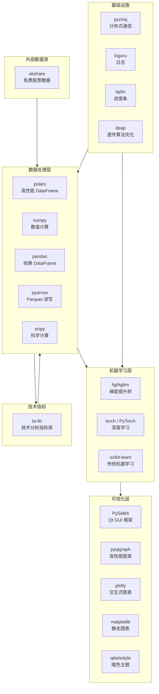

# VeighNa 量化代码工具库参考手册

> 本文档整理了 VeighNa 量化研究/交易代码中用到的所有第三方库，
> 按使用场景分类，标注用途、在项目中出现的位置，以及 Android 开发者可对照理解的类比。

---

## 目录

- [一、依赖关系全景图](#一依赖关系全景图)
- [二、数据处理层](#二数据处理层)
- [三、机器学习 / 模型训练层](#三机器学习--模型训练层)
- [四、技术指标计算](#四技术指标计算)
- [五、GUI / 可视化层](#五gui--可视化层)
- [六、通信 / 基础设施层](#六通信--基础设施层)
- [七、数据获取层（外部数据源）](#七数据获取层外部数据源)
- [八、工具类](#八工具类)
- [九、安装速查](#九安装速查)
- [十、Python 标准库速查](#十python-标准库速查)

---

## 一、依赖关系全景图



---

## 二、数据处理层

### Polars

| 项目 | 内容 |
|---|---|
| **包名** | `polars` |
| **当前版本** | 1.40.0 |
| **官网** | https://pola.rs |
| **用途** | 高性能 DataFrame 库，VeighNa Alpha 模块的**核心数据结构** |
| **项目中的位置** | `vnpy/alpha/` 下几乎所有文件 |
| **Android 类比** | 类似 Room 的 `@Query` 返回的数据表 + Kotlin Collections 的链式操作 |

**为什么用 Polars 而不是 Pandas?**
- Polars 基于 Rust 实现，比 Pandas 快 5-30 倍
- 支持懒计算（Lazy Evaluation），类似 Kotlin 的 `Sequence`
- 内存效率更高，处理 50 万行以上数据时优势明显

**常见用法**:

```python
import polars as pl

# 读取 Parquet 文件
df = pl.read_parquet("600519.SSE.parquet")

# 筛选 + 排序 (链式调用，类似 Kotlin 的 .filter{}.sortedBy{})
result = df.filter(pl.col("close") > 100).sort("datetime")

# 新增计算列 (类似 SQL 的 SELECT *, close/open AS ratio)
df = df.with_columns((pl.col("close") / pl.col("open")).alias("ratio"))

# 分组聚合 (类似 SQL 的 GROUP BY)
df.group_by("vt_symbol").agg(pl.col("close").mean())
```

---

### NumPy

| 项目 | 内容 |
|---|---|
| **包名** | `numpy` |
| **当前版本** | 2.4.4 |
| **官网** | https://numpy.org |
| **用途** | 数值计算基础库，所有科学计算库的底层 |
| **项目中的位置** | 模型训练 (`lgb_model.py`, `mlp_model.py`)、回测引擎、数据处理 |
| **Android 类比** | 类似 Android NDK 中的原生数组操作，但更高级 |

**核心概念**: `ndarray` — 多维数组，比 Python 列表快 100 倍

```python
import numpy as np

# 从 DataFrame 列转为 numpy 数组 (模型训练的输入格式)
features = df.select(df.columns[2:-1]).to_numpy()  # shape: (N, 158)
labels = np.array(df["label"])                       # shape: (N,)

# 数学运算 (向量化, 无需 for 循环)
returns = np.diff(prices) / prices[:-1]              # 日收益率
mean_return = np.mean(returns)                       # 平均收益
std_return = np.std(returns)                         # 收益标准差
```

---

### Pandas

| 项目 | 内容 |
|---|---|
| **包名** | `pandas` |
| **当前版本** | 2.3.3 |
| **官网** | https://pandas.pydata.org |
| **用途** | 经典 DataFrame 库，部分模块仍在使用 |
| **项目中的位置** | `lgb_model.py`（LightGBM 需要 Pandas 输入）、`ta_function.py`、`mlp_model.py` |
| **Android 类比** | 类似 Polars，但更老、更慢、生态更成熟 |

**为什么项目中同时有 Polars 和 Pandas?**
VeighNa 核心使用 Polars，但 LightGBM 和 TA-Lib 的 API 要求 Pandas 格式，所以在这些接口处会做转换：

```python
# Polars -> Pandas (喂给 LightGBM)
pd_data = df.select(feature_columns).to_pandas()

# Pandas -> Polars (从 TA-Lib 接收结果)
pl_result = pl.from_pandas(pd_result)
```

---

### PyArrow

| 项目 | 内容 |
|---|---|
| **包名** | `pyarrow` |
| **当前版本** | 23.0.1 |
| **官网** | https://arrow.apache.org/docs/python/ |
| **用途** | Apache Arrow 的 Python 实现，**Parquet 文件的读写引擎** |
| **项目中的位置** | Polars 内部依赖，`lab.py` 的 `save_bar_data()` / `load_bar_df()` |
| **Android 类比** | 类似 Protobuf / FlatBuffers —— 高效的列式序列化格式 |

**Parquet 格式的优势**:
- 列式存储，读取部分列极快（不用扫描整行）
- 自带压缩，比 CSV 小 5-10 倍
- 数据类型保留（日期就是日期，不会变成字符串）

---

### SciPy

| 项目 | 内容 |
|---|---|
| **包名** | `scipy` |
| **当前版本** | 1.17.1 |
| **官网** | https://scipy.org |
| **用途** | 科学计算工具箱，提供统计、线性代数、优化等功能 |
| **项目中的位置** | `vnpy/alpha/dataset/ts_function.py` — 时序统计函数 |
| **具体使用** | `scipy.stats` 中的统计函数（线性回归斜率、R² 等） |

```python
from scipy import stats

# 计算线性回归斜率 (用于 beta 因子)
slope, intercept, r_value, p_value, std_err = stats.linregress(x, y)
```

---

## 三、机器学习 / 模型训练层

### LightGBM

| 项目 | 内容 |
|---|---|
| **包名** | `lightgbm` |
| **当前版本** | 4.6.0 |
| **官网** | https://lightgbm.readthedocs.io |
| **用途** | 梯度提升树模型，**Alpha 模块默认的预测模型** |
| **项目中的位置** | `vnpy/alpha/model/models/lgb_model.py` |
| **Android 类比** | 类似 TensorFlow Lite，但是是树模型而非神经网络 |

**核心 API**:

```python
import lightgbm as lgb

# 准备数据
train_data = lgb.Dataset(X_train, label=y_train)
valid_data = lgb.Dataset(X_valid, label=y_valid)

# 训练模型
params = {
    "objective": "mse",           # 损失函数: 均方误差
    "learning_rate": 0.05,        # 学习率
    "num_leaves": 63,             # 叶节点数
}
model = lgb.train(
    params,
    train_data,
    num_boost_round=1000,         # 最大轮数
    valid_sets=[train_data, valid_data],
    callbacks=[
        lgb.early_stopping(50),   # 50轮没改善就停
        lgb.log_evaluation(20),   # 每20轮打印日志
    ]
)

# 预测
predictions = model.predict(X_test)  # 返回 numpy 数组

# 特征重要性
importance = model.feature_importance(importance_type='gain')
```

---

### PyTorch

| 项目 | 内容 |
|---|---|
| **包名** | `torch` |
| **当前版本** | 2.11.0 |
| **官网** | https://pytorch.org |
| **用途** | 深度学习框架，用于 MLP（多层感知机）模型 |
| **项目中的位置** | `vnpy/alpha/model/models/mlp_model.py` |
| **Android 类比** | 类似 TensorFlow Lite，但更底层、更灵活 |

**在项目中的使用**:

```python
import torch
import torch.nn as nn

# 定义网络结构
model = nn.Sequential(
    nn.Linear(158, 256),    # 输入层: 158个因子 → 256个神经元
    nn.ReLU(),              # 激活函数
    nn.Linear(256, 1),      # 输出层: 1个预测值
)

# 训练循环
optimizer = torch.optim.Adam(model.parameters(), lr=0.001)
loss_fn = nn.MSELoss()

for epoch in range(300):
    pred = model(X_tensor)
    loss = loss_fn(pred, y_tensor)
    loss.backward()
    optimizer.step()
```

---

### scikit-learn

| 项目 | 内容 |
|---|---|
| **包名** | `scikit-learn` (import 为 `sklearn`) |
| **当前版本** | 1.8.0 |
| **官网** | https://scikit-learn.org |
| **用途** | 经典机器学习工具箱，提供 Lasso 回归、评估指标等 |
| **项目中的位置** | `lasso_model.py`（Lasso 模型）、`mlp_model.py`（MSE 评估） |

```python
from sklearn.linear_model import Lasso
from sklearn.metrics import mean_squared_error

# Lasso 回归 (L1 正则化线性模型)
model = Lasso(alpha=0.0005)
model.fit(X_train, y_train)
predictions = model.predict(X_test)

# 评估
mse = mean_squared_error(y_test, predictions)
```

---

## 四、技术指标计算

### TA-Lib

| 项目 | 内容 |
|---|---|
| **包名** | `ta-lib` (import 为 `talib`) |
| **当前版本** | 0.6.8 |
| **官网** | https://ta-lib.github.io/ta-lib-python/ |
| **用途** | 技术分析指标库，计算 MACD、RSI、布林带等经典指标 |
| **项目中的位置** | `vnpy/alpha/dataset/ta_function.py`、`vnpy/trader/utility.py` |
| **安装注意** | 需要先安装 C 语言底层库（macOS: `brew install ta-lib`） |

```python
import talib
import numpy as np

close = np.array([...])  # 收盘价序列

# 常用技术指标
macd, signal, hist = talib.MACD(close)           # MACD
rsi = talib.RSI(close, timeperiod=14)             # RSI
upper, middle, lower = talib.BBANDS(close)         # 布林带
sma_20 = talib.SMA(close, timeperiod=20)           # 20日均线
```

**Alpha158 中 ta_function.py 的封装**: VeighNa 将 TA-Lib 封装为表达式 DSL，可在因子定义中使用 `ta_*` 前缀调用。

---

## 五、GUI / 可视化层

### PySide6

| 项目 | 内容 |
|---|---|
| **包名** | `PySide6` |
| **当前版本** | 6.8.2.1 |
| **官网** | https://doc.qt.io/qtforpython-6/ |
| **用途** | Qt 6 的 Python 绑定，VeighNa **桌面 GUI 的基础框架** |
| **项目中的位置** | `vnpy/trader/ui/` 下所有 Widget |
| **Android 类比** | 类似 Android 的 `View` / `Activity` / `Fragment` 体系 |

**核心概念对照**:

| PySide6 (Qt) | Android | 说明 |
|---|---|---|
| `QMainWindow` | `Activity` | 主窗口 |
| `QDockWidget` | `Fragment` | 可停靠面板 |
| `QTableWidget` | `RecyclerView` | 表格控件 |
| `Signal/Slot` | `LiveData/Observer` | 线程安全的事件通知 |
| `QThread` | `HandlerThread` | 后台线程 |

---

### pyqtgraph

| 项目 | 内容 |
|---|---|
| **包名** | `pyqtgraph` |
| **当前版本** | 0.14.0 |
| **官网** | https://www.pyqtgraph.org |
| **用途** | 高性能实时图表库，绘制 **K 线图和成交量柱图** |
| **项目中的位置** | `vnpy/chart/` 模块 |
| **Android 类比** | 类似 `MPAndroidChart`，但专为实时数据优化 |

---

### Plotly

| 项目 | 内容 |
|---|---|
| **包名** | `plotly` |
| **当前版本** | 6.7.0 |
| **官网** | https://plotly.com/python/ |
| **用途** | 交互式图表库，回测引擎用于绘制**净值曲线和回撤图** |
| **项目中的位置** | `vnpy/alpha/strategy/backtesting.py` |

---

### Matplotlib

| 项目 | 内容 |
|---|---|
| **包名** | `matplotlib` |
| **当前版本** | 3.10.8 |
| **官网** | https://matplotlib.org |
| **用途** | Python 最经典的绑图库，用于绘制**特征重要性图** |
| **项目中的位置** | `vnpy/alpha/model/models/lgb_model.py` 的 `detail()` 方法 |

---

### QDarkStyle

| 项目 | 内容 |
|---|---|
| **包名** | `qdarkstyle` |
| **当前版本** | 3.2.3 |
| **用途** | Qt 暗色主题样式表，让 GUI 界面使用深色风格 |
| **项目中的位置** | `vnpy/trader/ui/qt.py` |
| **Android 类比** | 类似 `Theme.Material3.Dark` |

---

## 六、通信 / 基础设施层

### PyZMQ

| 项目 | 内容 |
|---|---|
| **包名** | `pyzmq` (import 为 `zmq`) |
| **当前版本** | 27.1.0 |
| **官网** | https://zeromq.org |
| **用途** | ZeroMQ 消息队列，实现 **RPC 跨进程通信** |
| **项目中的位置** | `vnpy/rpc/server.py`、`vnpy/rpc/client.py` |
| **Android 类比** | 类似 `AIDL` / `Binder` 跨进程通信 |

**两种通信模式**:
- **REQ/REP** (请求/应答): 客户端调用服务端方法，等待返回结果
- **PUB/SUB** (发布/订阅): 服务端推送行情，客户端自动接收

---

### Loguru

| 项目 | 内容 |
|---|---|
| **包名** | `loguru` |
| **当前版本** | 0.7.3 |
| **官网** | https://loguru.readthedocs.io |
| **用途** | 日志库，替代 Python 标准 `logging` |
| **项目中的位置** | `vnpy/trader/logger.py`、`vnpy/alpha/logger.py` |
| **Android 类比** | 类似 `Timber` |

```python
from loguru import logger

logger.info("模型训练完成")
logger.warning("数据缺失: {}", symbol)
logger.error("连接失败: {}", e)
```

---

### tqdm

| 项目 | 内容 |
|---|---|
| **包名** | `tqdm` |
| **当前版本** | 4.67.3 |
| **官网** | https://tqdm.github.io |
| **用途** | 进度条库，在因子计算和回测时显示进度 |
| **项目中的位置** | `vnpy/alpha/dataset/template.py`、`backtesting.py`、`optimize.py` |

```python
from tqdm import tqdm

for item in tqdm(items, desc="计算因子"):
    process(item)
# 输出: 计算因子:  45%|████▌     | 72/159 [00:04<00:05, 15.2it/s]
```

---

### DEAP

| 项目 | 内容 |
|---|---|
| **包名** | `deap` |
| **当前版本** | 1.4 |
| **官网** | https://deap.readthedocs.io |
| **用途** | 遗传算法框架，用于**策略参数自动优化** |
| **项目中的位置** | `vnpy/trader/optimize.py` |

在策略回测时，可以用遗传算法自动搜索最优的参数组合（如 top_k、n_drop 的最优值），比暴力遍历快得多。

---

### Alphalens

| 项目 | 内容 |
|---|---|
| **包名** | `alphalens-reloaded` (import 为 `alphalens`) |
| **当前版本** | 0.4.6 |
| **官网** | https://github.com/stefan-jansen/alphalens-reloaded |
| **用途** | 因子分析工具，用于评估单个因子的有效性 |
| **项目中的位置** | `vnpy/alpha/dataset/template.py` |

可以对单个因子生成"泪水图"（tear sheet），展示因子的 IC 值、分组收益、换手率等。

---

## 七、数据获取层（外部数据源）

### AKShare

| 项目 | 内容 |
|---|---|
| **包名** | `akshare` |
| **当前版本** | 1.18.55 |
| **官网** | https://akshare.akfamily.xyz |
| **用途** | **免费**开源金融数据接口，无需注册、无需 Token |
| **项目中的位置** | `download_real_data.py`、`download_hs300.py` |
| **数据源** | 新浪财经、东方财富等公开数据 |

```python
import akshare as ak

# 获取沪深300成分股列表
cons = ak.index_stock_cons(symbol="000300")

# 获取个股日线数据 (前复权)
df = ak.stock_zh_a_daily(symbol="sh600519", start_date="20150101",
                          end_date="20241231", adjust="qfq")
```

**注意**: AKShare 通过爬取公开数据获取，非官方 API，请求间隔建议 >= 1 秒。

---

### nbformat

| 项目 | 内容 |
|---|---|
| **包名** | `nbformat` |
| **当前版本** | 5.10.4 |
| **用途** | Jupyter Notebook 文件格式读写 |
| **项目中的位置** | 核心依赖（支持在 Jupyter 中使用 VeighNa） |

---

## 八、工具类

### tzlocal

| 项目 | 内容 |
|---|---|
| **包名** | `tzlocal` |
| **用途** | 获取系统本地时区 |
| **项目中的位置** | `vnpy/trader/setting.py`、`vnpy/trader/ui/widget.py` |

---

## 九、安装速查

```bash
# 激活虚拟环境
source .venv/bin/activate

# 核心依赖 (安装 vnpy 时自动安装)
pip install -e .

# Alpha 研究依赖 (Polars, LightGBM, PyTorch, scikit-learn 等)
pip install -e ".[alpha]"

# macOS 需要额外安装 TA-Lib 的 C 库
brew install ta-lib

# macOS LightGBM 需要 OpenMP
brew install libomp

# 免费数据源
pip install akshare
```

---

## 十、Python 标准库速查

以下标准库在项目中频繁使用，Android 开发者可能不太熟悉：

| 标准库 | 用途 | 项目中的使用场景 | Android 类比 |
|---|---|---|---|
| `shelve` | 键值对持久化 | 存储成分股索引（每日成分列表） | `SharedPreferences` |
| `pickle` | Python 对象序列化 | 保存/加载模型、数据集 | `Parcelable` / `Serializable` |
| `json` | JSON 读写 | 合约参数 `contract.json` | `Gson` / `Moshi` |
| `pathlib.Path` | 面向对象的路径操作 | Lab 目录管理 | `java.io.File` |
| `dataclasses` | 数据类 | `BarData`、`OrderData` 等 DTO | Kotlin `data class` |
| `functools.partial` | 偏函数（预填充部分参数） | 注册数据处理器 | 无直接对应，类似 lambda 捕获变量 |
| `multiprocessing` | 多进程并行 | 因子计算加速 | `Coroutine` + `Dispatchers.Default` |
| `threading` | 多线程 | 事件引擎、RPC 通信 | `Thread` / `HandlerThread` |
| `queue.Queue` | 线程安全队列 | 事件引擎的事件队列 | `Handler.MessageQueue` |
| `abc.ABCMeta` | 抽象基类 | `BaseGateway`、`AlphaModel` | `abstract class` |
| `enum.Enum` | 枚举 | `Exchange`、`Direction`、`Interval` | Kotlin `enum class` |
| `collections.defaultdict` | 默认值字典 | 持仓天数追踪、事件处理器注册 | `Map.getOrDefault()` |
